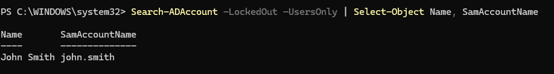
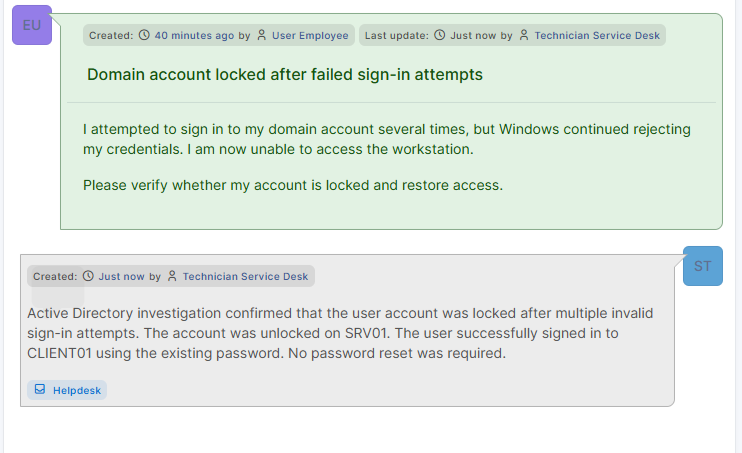
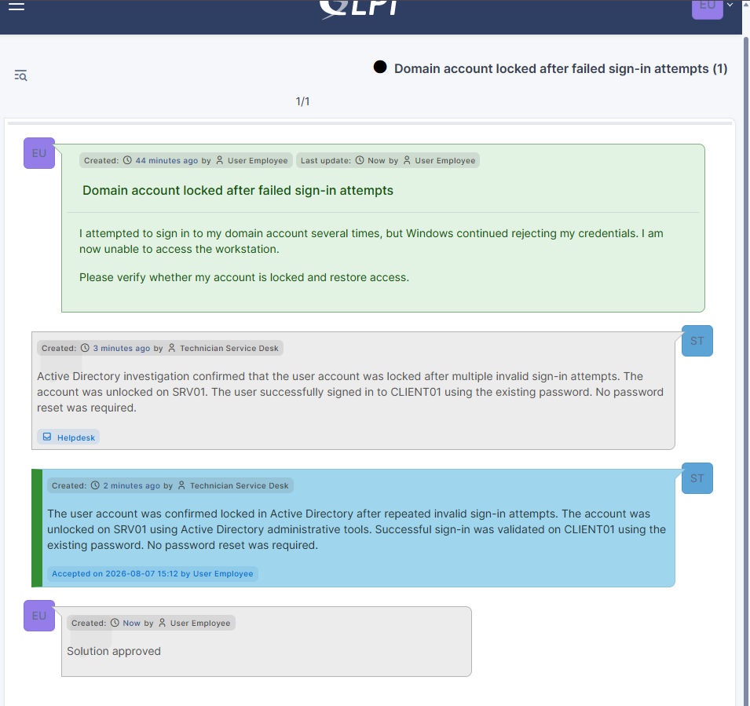
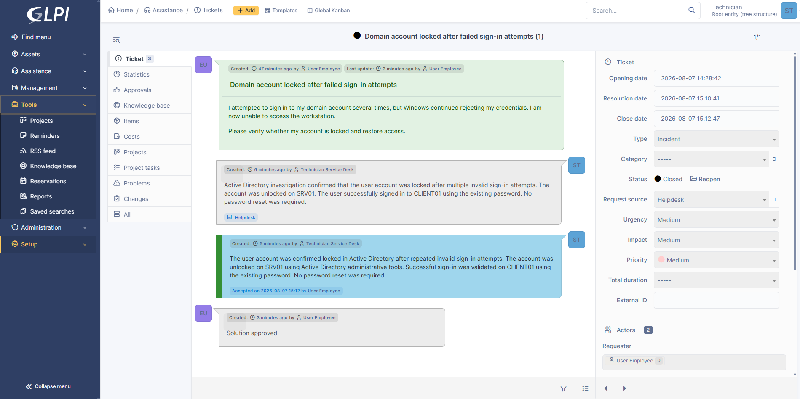
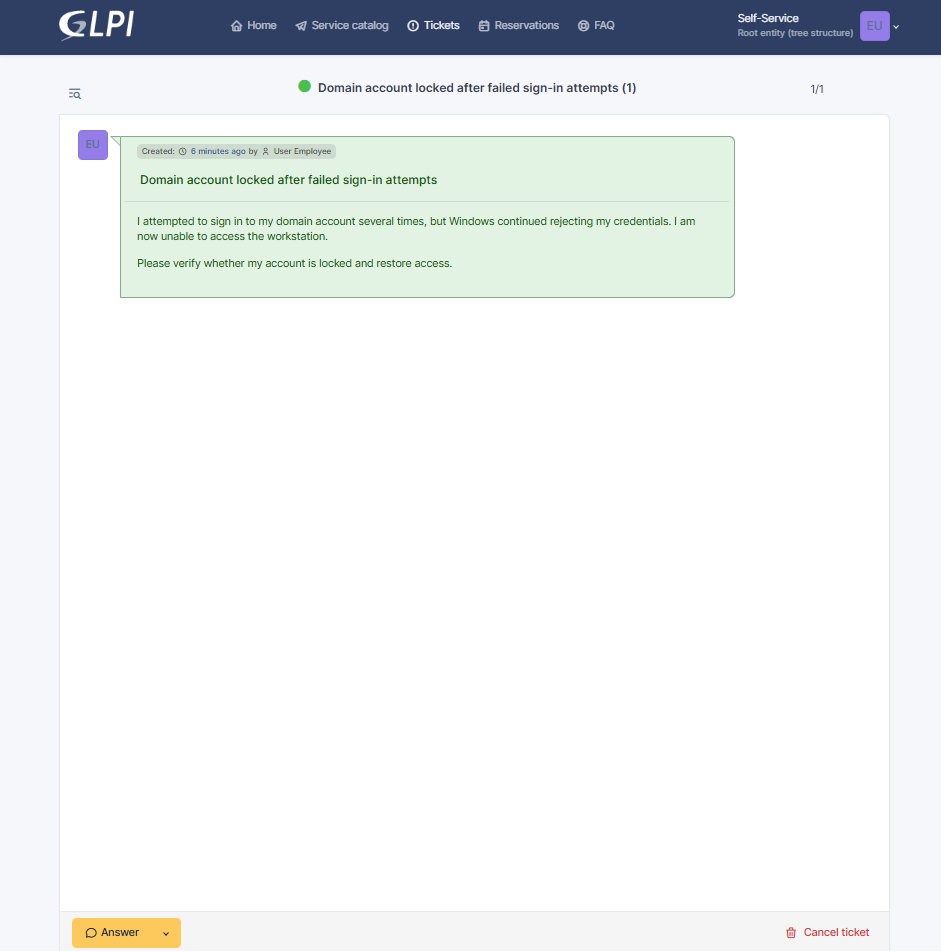
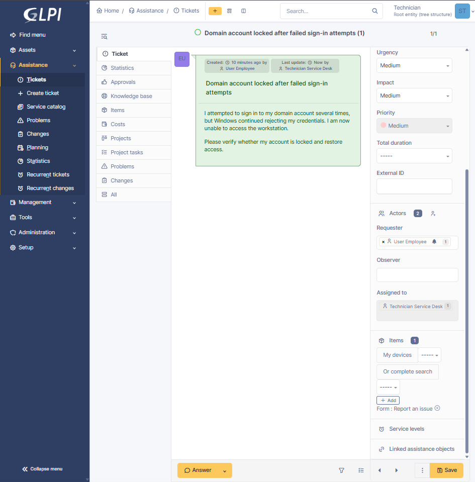

## Ticket Details

| Field | Value |
|---|---|
| Portfolio ID | INC-001 |
| GLPI Ticket ID | #1 |
| Ticket type | Incident |
| Category | Accounts and Access |
| Status | Closed |
| Urgency | Medium |
| Impact | Medium |
| Priority | Medium |
| Support level | Level 1 |
| Requester | Fictional employee user |
| Assigned technician | Service Desk Technician |
| Affected workstation | CLIENT01 |
| Identity server | SRV01 |
| Ticketing server | GLPI01 |

---

## User Report

The employee reported that several sign-in attempts were rejected and that access to the domain workstation was no longer available.

```text
I attempted to sign in to my domain account several times, but Windows
continued rejecting my credentials. I am now unable to access the
workstation.

Please verify whether my account is locked and restore access.
```

---

## Systems Involved

| System | Purpose |
|---|---|
| `CLIENT01` | Domain workstation where the sign-in failure occurred |
| `SRV01` | Active Directory server used to verify and unlock the account |
| `GLPI01` | GLPI server used to record and manage the incident |

---

## Account Lockout Policy

| Policy setting | Configured value |
|---|---:|
| Account lockout threshold | 5 invalid attempts |
| Account lockout observation window | 10 minutes |
| Account lockout duration | 30 minutes |

---

## Incident Timeline

| Step | Action | Result |
|---:|---|---|
| 1 | Employee attempted to sign in using incorrect credentials | Sign-in failed |
| 2 | Five failed attempts occurred within the observation window | Account locked |
| 3 | Employee submitted GLPI Ticket #1 | Ticket created |
| 4 | Ticket assigned to Service Desk Technician | Status changed to Processing |
| 5 | Active Directory account state checked on SRV01 | Lockout confirmed |
| 6 | Account unlocked on SRV01 | Lockout removed |
| 7 | User signed in again on CLIENT01 | Access restored |
| 8 | Technician follow-up added in GLPI | Investigation documented |
| 9 | Official solution added | Ticket marked Solved |
| 10 | Ticket administratively closed | Final status Closed |

---

## Investigation

The technician checked Active Directory for locked user accounts using:

```powershell
Search-ADAccount -LockedOut -UsersOnly |
Select-Object Name, SamAccountName
```

The affected test account appeared in the results, confirming that it was locked.



---

## Remediation

The affected account was unlocked on `SRV01` using:

```powershell
Unlock-ADAccount -Identity "REDACTED-TEST-USER"
```

The technician checked the locked-account list again:

```powershell
Search-ADAccount -LockedOut -UsersOnly |
Select-Object Name, SamAccountName
```

The account no longer appeared in the results.


---

## Validation

The employee signed in successfully to `CLIENT01` using the existing password.

No password reset was required.

| Validation check | Result |
|---|---|
| Account appeared in locked-account search | Confirmed |
| Unlock command completed | Confirmed |
| Account disappeared from locked-account search | Confirmed |
| User signed in using existing password | Successful |
| Access restored | Yes |


---

## Technician Follow-Up

```text
Active Directory investigation confirmed that the user account was
locked after multiple invalid sign-in attempts. The account was
unlocked on SRV01. The user successfully signed in to CLIENT01 using
the existing password. No password reset was required.
```



---

## Solution

```text
The user account was confirmed locked in Active Directory after repeated
invalid sign-in attempts. The account was unlocked on SRV01 using Active
Directory administrative tools. Successful sign-in was validated on
CLIENT01 using the existing password. No password reset was required.
```



---

## Root Cause

The employee entered an incorrect password five times within the configured ten-minute observation window.

The Active Directory account-lockout threshold was reached, causing the account to be temporarily blocked.

---

## Closure

| Closure check | Result |
|---|---|
| Incident investigated | Yes |
| Account unlocked | Yes |
| Existing password retained | Yes |
| Successful sign-in verified | Yes |
| Technician update recorded | Yes |
| Solution recorded | Yes |
| Ticket closed | Yes |



---

## Evidence

### Ticket submitted



### Ticket assigned



### Account lockout confirmed


### Account unlocked


### User sign-in validated


### Technician follow-up


### Ticket solved


### Ticket closed


---

## Final Status

```text
Portfolio ID    : INC-001
GLPI Ticket ID  : #1
Incident        : Active Directory Account Lockout
Access restored : Yes
Password reset  : No
Final status    : CLOSED
```

