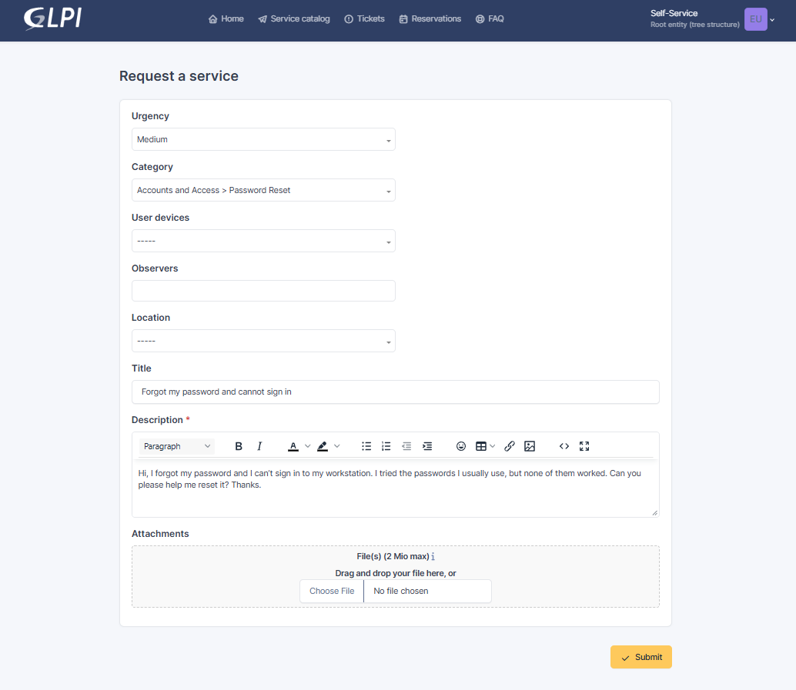
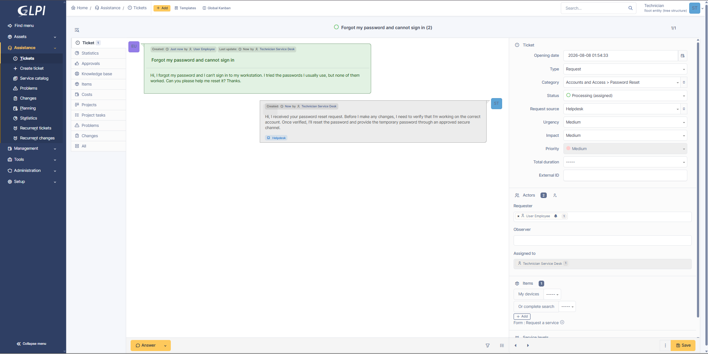
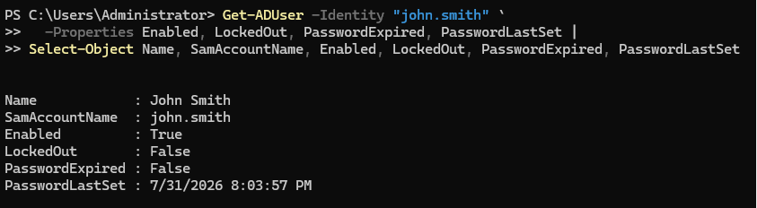
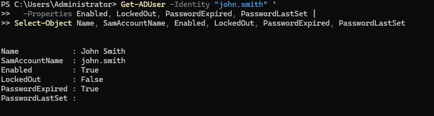
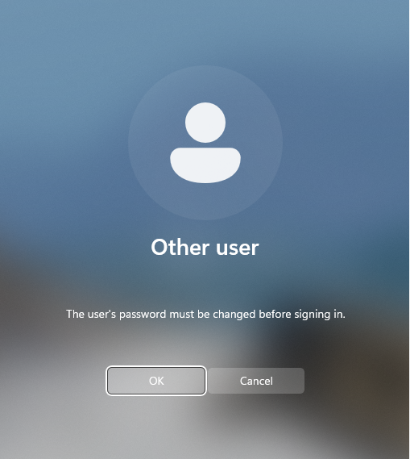
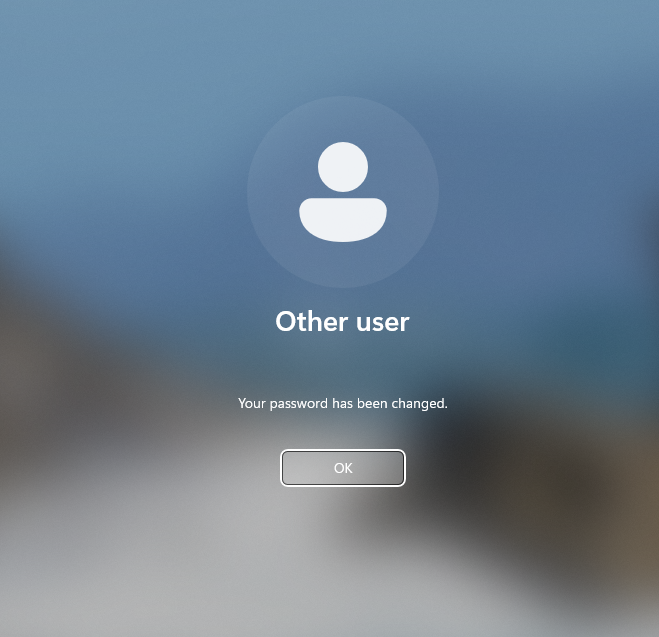
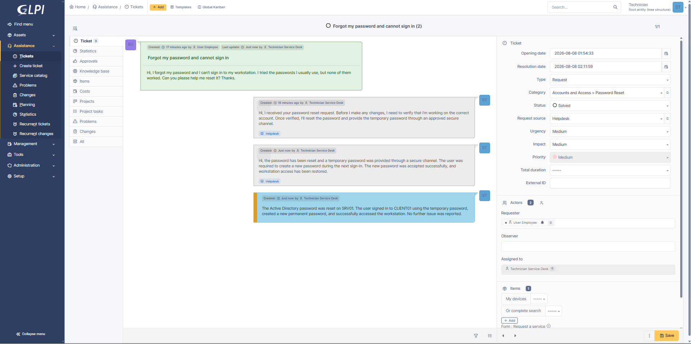
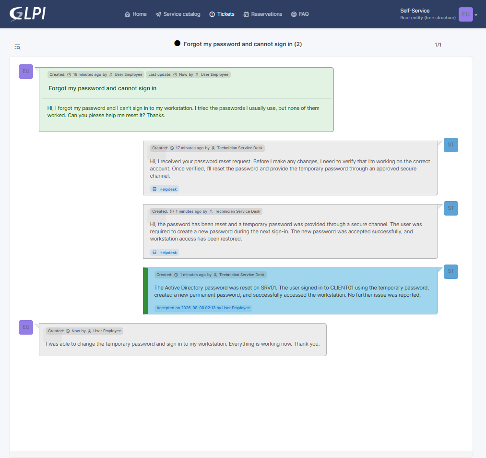
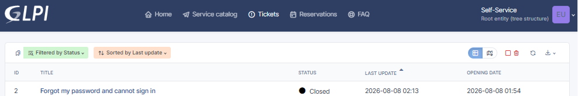

# INC-002 — Password Reset Request

## Ticket Details

| Field | Value |
|---|---|
| Portfolio ID | INC-002 |
| GLPI Ticket ID | #2 |
| Ticket type | Service Request |
| Category | Accounts and Access > Password Reset |
| Status | Closed |
| Urgency | Medium |
| Impact | Medium |
| Priority | Medium |
| Support level | Level 1 |
| Requester | Fictional employee user |
| Assigned technician | Service Desk Technician |
| Affected workstation | CLIENT01 |
| Identity server | SRV01 |
| Ticketing server | GLPI01 |

---

## User Request

> Hi, I forgot my password and I can’t sign in to my workstation. I tried the passwords I usually use, but none of them worked. Can you please help me reset it? Thanks.



---

## Systems Involved

| System | Purpose |
|---|---|
| `CLIENT01` | Workstation used to test the temporary and new passwords |
| `SRV01` | Active Directory server where the account password was reset |
| `GLPI01` | Ticketing server used to manage the request |

---

## Technician Acknowledgement

The request was assigned to the Service Desk Technician and moved to `Processing`.

> Hi, I received your password reset request. Before I make any changes, I need to verify that I’m working on the correct account. Once verified, I’ll reset the password and provide the temporary password through an approved secure channel.

No password was written in the GLPI ticket.



---

## Account Verification

Before resetting the password, the technician verified the account on `SRV01`.

```powershell
Get-ADUser -Identity "REDACTED-TEST-USER" `
  -Properties Enabled, LockedOut, PasswordExpired, PasswordLastSet |
Select-Object Name, SamAccountName, Enabled, LockedOut, PasswordExpired, PasswordLastSet
```

The review confirmed:

| Check | Result |
|---|---|
| Correct account selected | Confirmed |
| Account enabled | Yes |
| Account locked | No |
| Password reset required | Yes |



---

## Password Reset

A temporary password was entered securely without displaying or storing it in plain text.

```powershell
$newPassword = Read-Host "Enter temporary password" -AsSecureString
```

The account password was reset:

```powershell
Set-ADAccountPassword `
  -Identity "REDACTED-TEST-USER" `
  -Reset `
  -NewPassword $newPassword
```

The account was configured to require a password change at the next sign-in:

```powershell
Set-ADUser `
  -Identity "REDACTED-TEST-USER" `
  -ChangePasswordAtLogon $true
```

The temporary password was not added to GLPI, GitHub, screenshots, or documentation.



---

## Password Change at Sign-In

The employee signed in to `CLIENT01` using the temporary password.

Windows required the employee to create a new permanent password before continuing.



The employee created a new password and successfully opened the Windows desktop.



---

## Technician Update

> Hi, the password has been reset and a temporary password was provided through a secure channel. The user was required to create a new password during the next sign-in. The new password was accepted successfully, and workstation access has been restored.

---

## Solution

> The Active Directory password was reset on SRV01. The user signed in to CLIENT01 using the temporary password, created a new permanent password, and successfully accessed the workstation. No further issue was reported.



---

## User Confirmation

The employee confirmed that the password change was completed and workstation access was restored.

> I was able to change the temporary password and sign in to my workstation. Everything is working now. Thank you.



---

## Validation

| Validation check | Result |
|---|---|
| Account identity verified before reset | Passed |
| Account confirmed enabled | Passed |
| Account confirmed not locked | Passed |
| Temporary password created securely | Passed |
| Password reset completed | Passed |
| Password change required at next sign-in | Passed |
| Employee created a new password | Passed |
| Successful workstation sign-in verified | Passed |
| Passwords excluded from the ticket | Passed |
| Ticket closed | Passed |

---

## Ticket Timeline

| Step | Action | Result |
|---:|---|---|
| 1 | Employee submitted a password-reset request | Ticket #2 created |
| 2 | Request assigned to Service Desk Technician | Status changed to Processing |
| 3 | Account state verified on SRV01 | Correct active account confirmed |
| 4 | Temporary password created securely | Password not exposed |
| 5 | Active Directory password reset | Reset completed |
| 6 | Password change required at next sign-in | Policy applied |
| 7 | Employee signed in using temporary password | Password-change screen displayed |
| 8 | Employee created a permanent password | Password accepted |
| 9 | Successful access validated on CLIENT01 | Workstation access restored |
| 10 | Technician added the solution | Status changed to Solved |
| 11 | Request administratively closed | Final status Closed |

---

## Closure

| Closure check | Result |
|---|---|
| Request reviewed | Yes |
| Identity verified | Yes |
| Password reset completed | Yes |
| Temporary password protected | Yes |
| Permanent password created by employee | Yes |
| Workstation access restored | Yes |
| Technician update recorded | Yes |
| Solution recorded | Yes |
| Ticket closed | Yes |



---

## Technician Insight

I verified the account before resetting anything because I wanted to make sure I was working on the correct user and that the issue was not caused by a lockout or disabled account.

I used a secure PowerShell prompt so the temporary password would not appear in the command history. I also required the user to change it during the next sign-in instead of allowing the temporary password to remain active.

After the user created a new password and successfully opened the workstation, I updated the ticket and closed the request. I did not place either password in GLPI or in the documentation.

---

## Evidence Files

```text
images/INC-002-01-request-submitted.png
images/INC-002-02-ticket-assigned-and-acknowledged.png
images/INC-002-03-account-state-verified.png
images/INC-002-04-password-reset-completed.png
images/INC-002-05-password-change-required.png
images/INC-002-06-new-password-sign-in-validated.png
images/INC-002-07-ticket-solved.png
images/INC-002-08-user-confirmation.png
images/INC-002-09-ticket-closed.png
```

---

## Final Status

```text
Portfolio ID       : INC-002
GLPI Ticket ID     : #2
Request            : Password Reset
Password reset     : Completed
Password exposed   : No
Access restored    : Yes
Final status       : CLOSED
```
