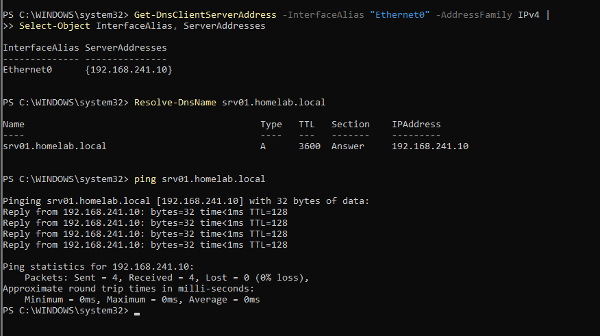
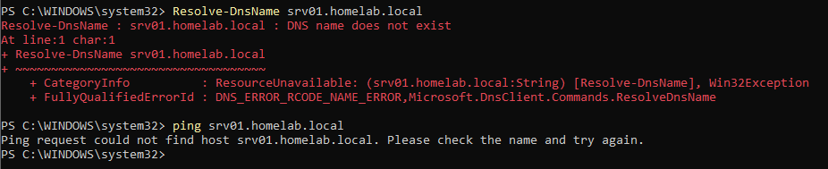
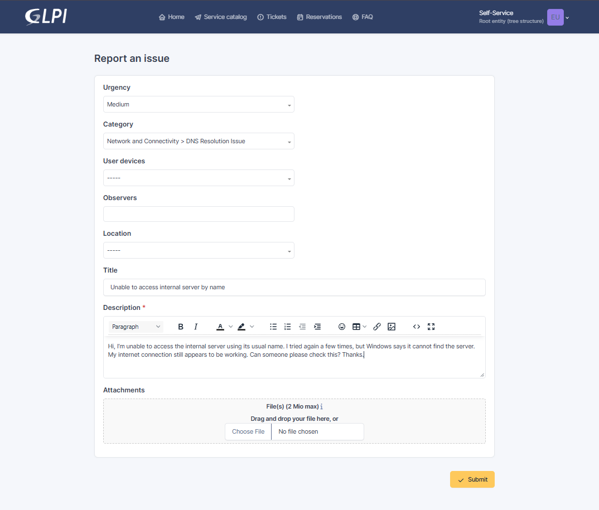
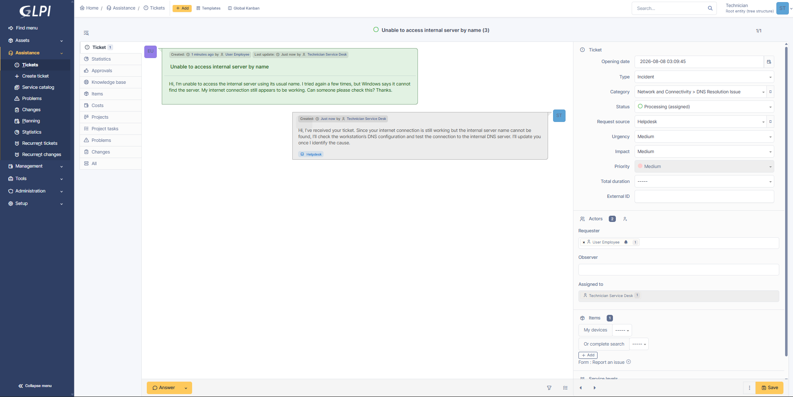
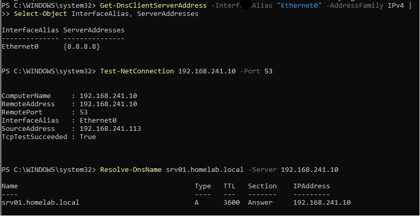
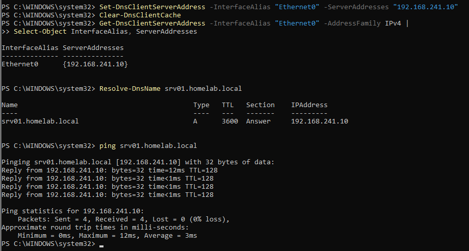
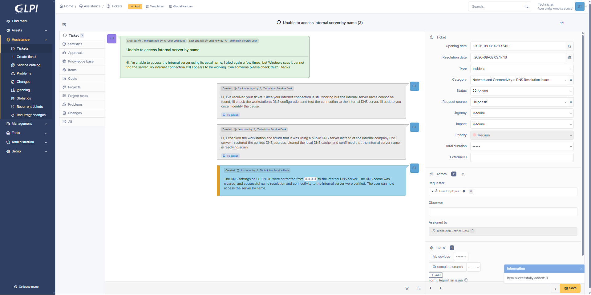
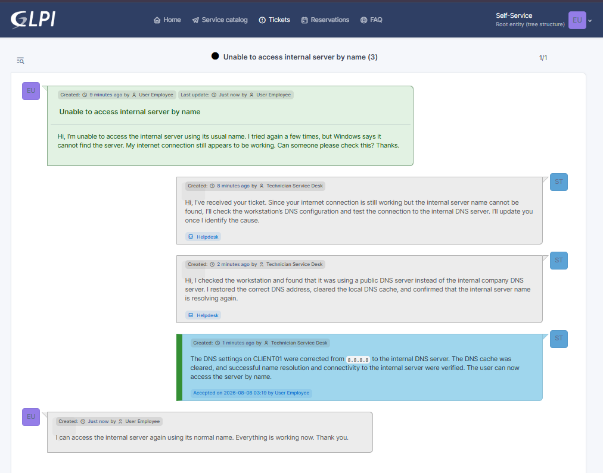

## Step-by-Step Technical Procedure

### Step 1 — Identify the active network adapter

**System:** `CLIENT01`  
**Tool:** Windows PowerShell  
**Purpose:** Identify the network adapter currently connected to the VMware network.

```powershell
Get-NetAdapter |
Where-Object Status -eq "Up" |
Select-Object Name, InterfaceDescription, Status
```

**Result:**

```text
Adapter name : Ethernet0
Status       : Up
```

The active adapter was identified as `Ethernet0`.

---

### Step 2 — Record the working DNS configuration

**System:** `CLIENT01`  
**Tool:** Windows PowerShell  
**Purpose:** Record the correct DNS configuration before reproducing the issue.

```powershell
Get-DnsClientServerAddress `
  -InterfaceAlias "Ethernet0" `
  -AddressFamily IPv4 |
Select-Object InterfaceAlias, ServerAddresses
```

**Result:**

```text
InterfaceAlias : Ethernet0
DNS server     : 192.168.241.10
```

The workstation was correctly using `SRV01` as its internal DNS server.

---

### Step 3 — Confirm the working DNS baseline

**System:** `CLIENT01`  
**Purpose:** Verify that the internal server name resolved correctly before the incident.

```powershell
Resolve-DnsName srv01.homelab.local
```

```powershell
ping srv01.homelab.local
```

**Result:**

- The hostname resolved successfully.
- The hostname returned the internal server IP address.
- Ping by hostname succeeded.



---

### Step 4 — Reproduce the DNS issue

**System:** `CLIENT01`  
**Purpose:** Simulate a workstation configured with an incorrect DNS server.

```powershell
Set-DnsClientServerAddress `
  -InterfaceAlias "Ethernet0" `
  -ServerAddresses "8.8.8.8"
```

The local DNS cache was cleared:

```powershell
Clear-DnsClientCache
```

The new DNS setting was verified:

```powershell
Get-DnsClientServerAddress `
  -InterfaceAlias "Ethernet0" `
  -AddressFamily IPv4 |
Select-Object InterfaceAlias, ServerAddresses
```

**Result:**

```text
DNS server : 8.8.8.8
```

---

### Step 5 — Confirm the reported failure

**System:** `CLIENT01`  
**Purpose:** Confirm that the workstation could no longer resolve the private domain name.

```powershell
Resolve-DnsName srv01.homelab.local
```

```powershell
ping srv01.homelab.local
```

**Result:**

- Internet connectivity remained available.
- The internal hostname could not be resolved.
- Windows could not find `srv01.homelab.local`.



---

### Step 6 — Create the GLPI incident

**System:** `GLPI01`  
**Account:** `employee.user`

The employee submitted the following incident:

```text
Title    : Unable to access internal server by name
Type     : Incident
Category : Network and Connectivity > DNS Resolution Issue
Urgency  : Medium
```

**Employee message:**

> Hi, I’m unable to access the internal server using its usual name. I tried again a few times, but Windows says it cannot find the server. My internet connection still appears to be working. Can someone please check this? Thanks.



---

### Step 7 — Assign and acknowledge the ticket

**System:** `GLPI01`  
**Account:** `servicedesk.tech`

The technician:

1. Opened Ticket #3.
2. Assigned the ticket to `servicedesk.tech`.
3. Changed the status to `Processing (assigned)`.
4. Added an acknowledgement for the requester.

**Technician message:**

> Hi, I’ve received your ticket. Since your internet connection is still working but the internal server name cannot be found, I’ll check the workstation’s DNS configuration and test the connection to the internal DNS server. I’ll update you once I identify the cause.



---

### Step 8 — Review the workstation DNS setting

**System:** `CLIENT01`

```powershell
Get-DnsClientServerAddress `
  -InterfaceAlias "Ethernet0" `
  -AddressFamily IPv4 |
Select-Object InterfaceAlias, ServerAddresses
```

**Result:**

```text
Configured DNS server : 8.8.8.8
Expected DNS server   : 192.168.241.10
```

The workstation was using a public DNS server instead of the internal Active Directory DNS server.

---

### Step 9 — Test the internal DNS server

**System:** `CLIENT01`  
**Purpose:** Determine whether the DNS server itself was unavailable.

```powershell
Test-NetConnection 192.168.241.10 -Port 53
```

**Result:**

```text
TcpTestSucceeded : True
```

Port 53 was reachable, confirming that the internal DNS service was available.

---

### Step 10 — Test the DNS record directly

**System:** `CLIENT01`

```powershell
Resolve-DnsName `
  srv01.homelab.local `
  -Server 192.168.241.10
```

**Result:**

The internal DNS server successfully returned the record for `srv01.homelab.local`.

This confirmed:

```text
DNS server available : Yes
DNS record available : Yes
Client DNS setting   : Incorrect
```



---

### Step 11 — Restore the correct DNS configuration

**System:** `CLIENT01`

```powershell
Set-DnsClientServerAddress `
  -InterfaceAlias "Ethernet0" `
  -ServerAddresses "192.168.241.10"
```

The DNS cache was cleared:

```powershell
Clear-DnsClientCache
```

---

### Step 12 — Verify the corrected configuration

```powershell
Get-DnsClientServerAddress `
  -InterfaceAlias "Ethernet0" `
  -AddressFamily IPv4 |
Select-Object InterfaceAlias, ServerAddresses
```

**Result:**

```text
InterfaceAlias : Ethernet0
DNS server     : 192.168.241.10
```

The workstation was again using the correct internal DNS server.

---

### Step 13 — Validate name resolution and connectivity

```powershell
Resolve-DnsName srv01.homelab.local
```

```powershell
ping srv01.homelab.local
```

**Result:**

- Internal hostname resolution succeeded.
- The correct IP address was returned.
- Connectivity by hostname succeeded.



---

### Step 14 — Update and solve the GLPI ticket

The technician added this update:

> Hi, I checked the workstation and found that it was using a public DNS server instead of the internal company DNS server. I restored the correct DNS address, cleared the local DNS cache, and confirmed that the internal server name is resolving again.

The official solution was recorded:

> The DNS settings on CLIENT01 were corrected from the public DNS server to the internal DNS server. The DNS cache was cleared, and successful name resolution and connectivity to the internal server were verified. The user can now access the server by name.

The ticket status was changed to `Solved`.



---

### Step 15 — Obtain user confirmation and close the ticket

The employee confirmed:

> I can access the internal server again using its normal name. Everything is working now. Thank you.

The solution was accepted, and the final ticket status changed to `Closed`.


