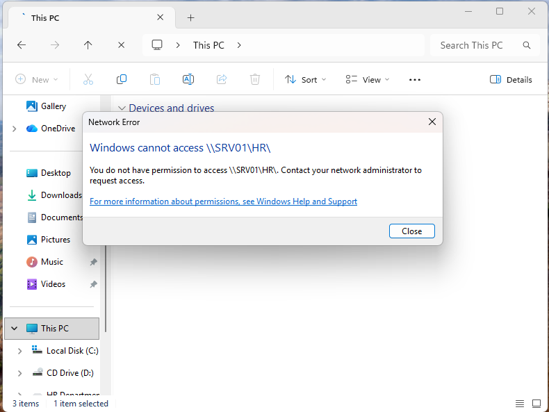
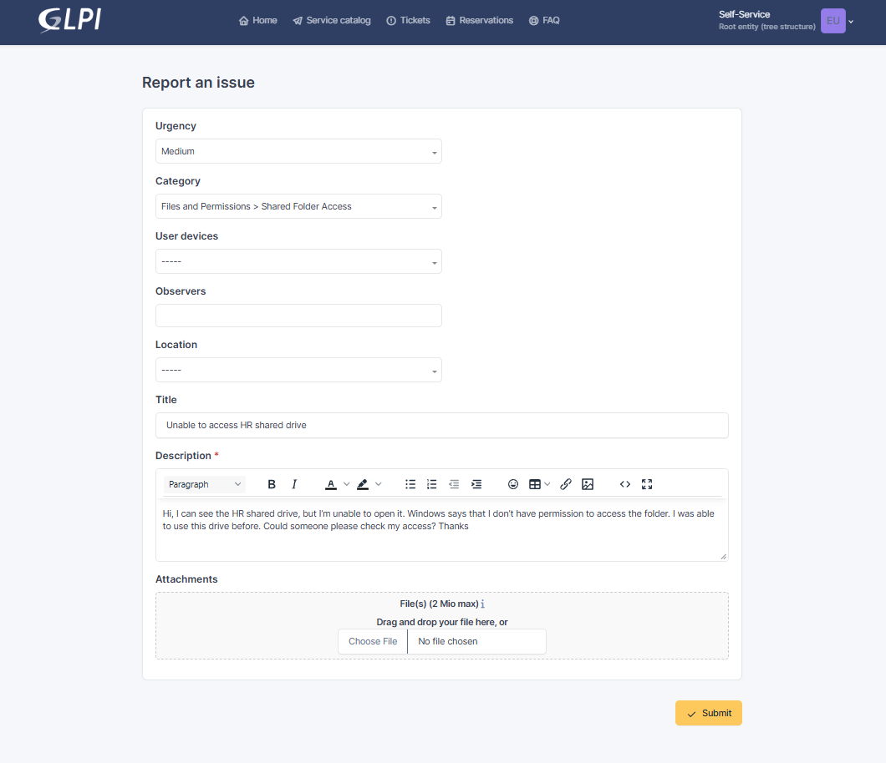
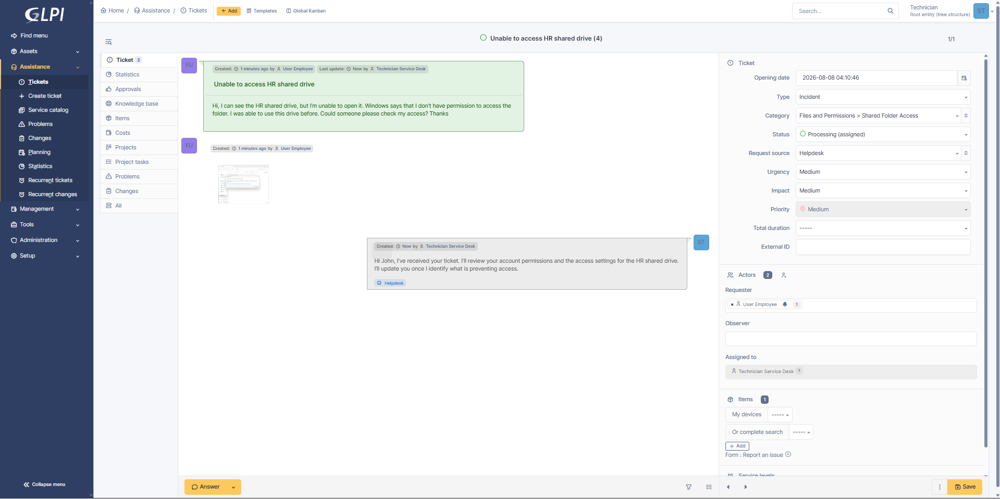
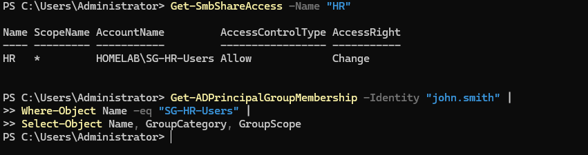
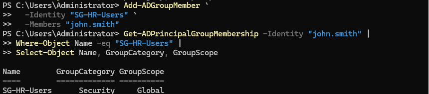
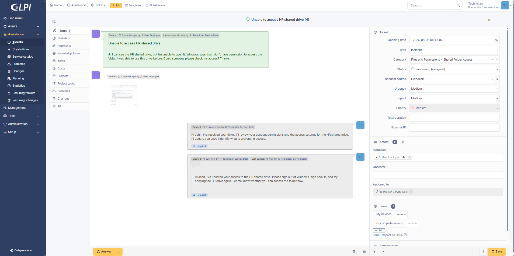
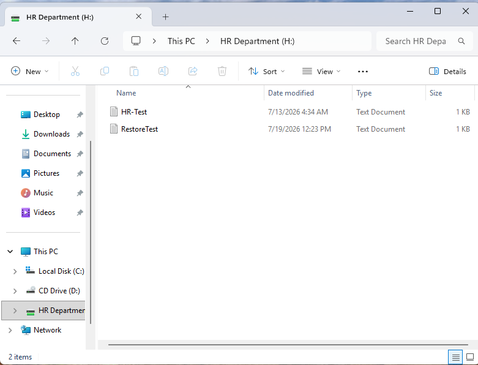
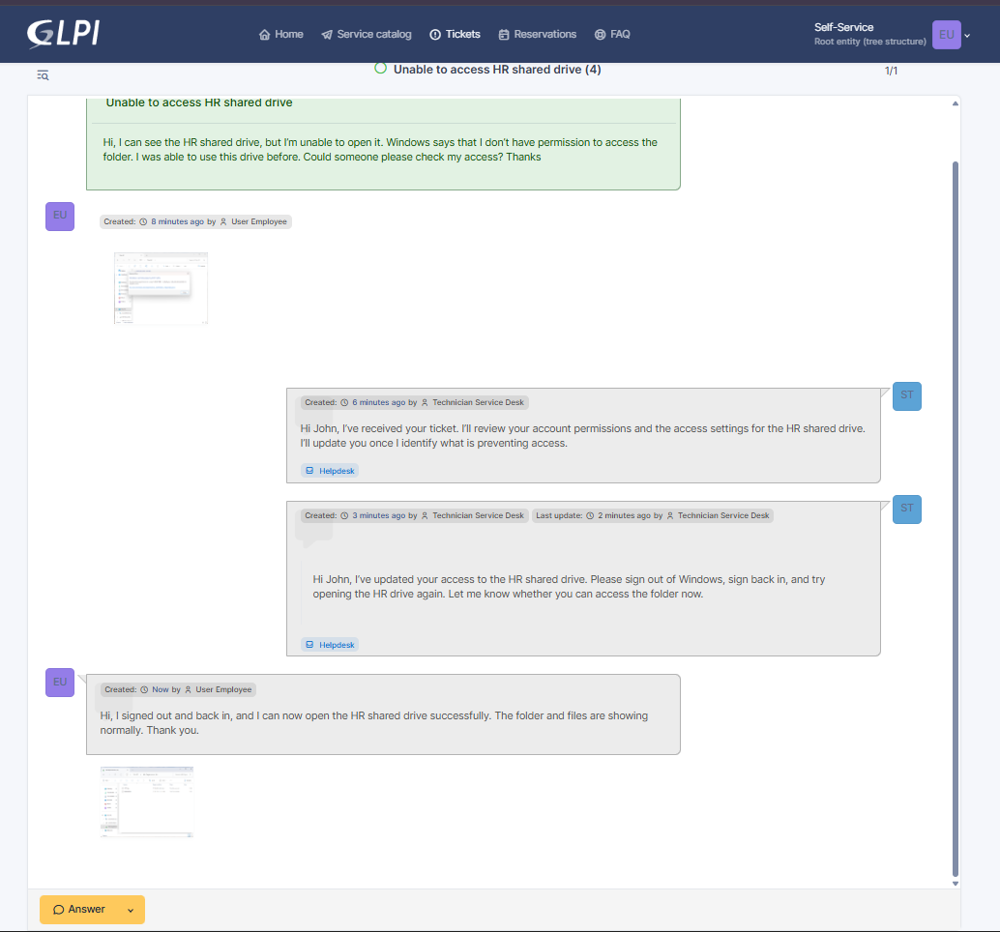
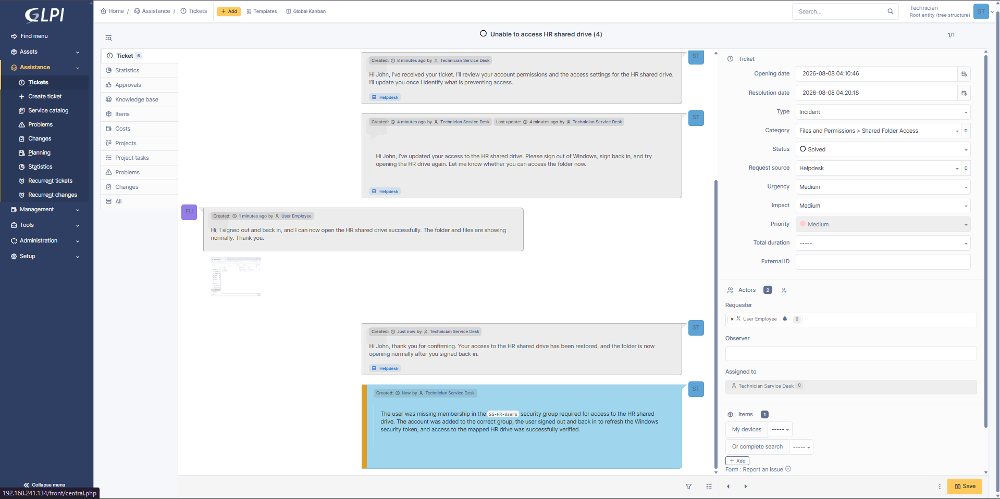
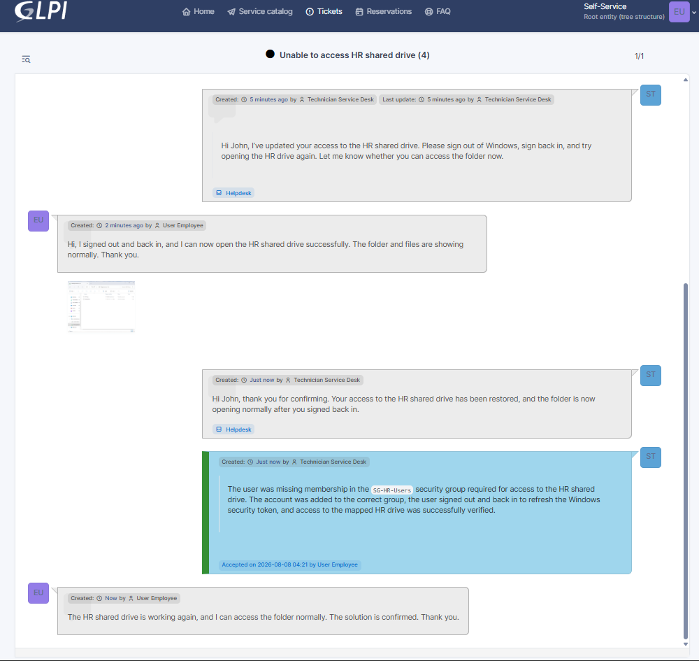

# INC-004 — Shared Folder Access Denied

## Ticket Details

| Field | Value |
|---|---|
| Portfolio ID | INC-004 |
| GLPI Ticket ID | #4 |
| Ticket type | Incident |
| Category | Files and Permissions > Shared Folder Access |
| Status | Closed |
| Urgency | Medium |
| Impact | Medium |
| Priority | Medium |
| Support level | Level 1 |
| Requester | John Smith |
| Assigned technician | Service Desk Technician |
| Affected account | `john.smith` |
| Affected workstation | CLIENT01 |
| File server | SRV01 |
| Ticketing server | GLPI01 |
| Affected drive | `H:` |
| Shared folder | `\\SRV01\HR` |
| Required security group | `SG-HR-Users` |

---

## Issue Type

This was a shared-folder permission incident.

John Smith could see the mapped HR drive on `CLIENT01`, but Windows prevented him from opening it because his account did not have the required security-group membership.

The issue affected one employee account and prevented access to the HR departmental shared folder.

---

## User-Reported Issue

John Smith attempted to open the mapped HR drive:

```text
H:
```

The mapped drive pointed to:

```text
\\SRV01\HR
```

Windows displayed an access-denied message because the account did not have permission to open the folder.



---

## User Report

John Smith submitted the following incident through GLPI:

> Hi, I can see the HR shared drive, but I’m unable to open it. Windows says that I don’t have permission to access the folder. I was able to use this drive before. Could someone please check my access? Thanks.



---

## Systems Involved

| System | Purpose |
|---|---|
| `CLIENT01` | Domain-joined workstation used by John Smith |
| `SRV01` | Active Directory and file server hosting the HR share |
| `GLPI01` | GLPI ticketing server |
| `SG-HR-Users` | Active Directory security group controlling HR folder access |

---

## Technician Acknowledgement

The ticket was assigned to the Service Desk Technician and moved to `Processing`.

> Hi John, I’ve received your ticket. I’ll review your account permissions and the access settings for the HR shared drive. I’ll update you once I identify what is preventing access.



---

## Investigation

The technician first reviewed the permissions configured on the HR shared folder:

```powershell
Get-SmbShareAccess -Name "HR"
```

The results showed that access to the share was assigned to:

```text
HOMELAB\SG-HR-Users
```

The technician then checked John Smith’s current Active Directory group memberships:

```powershell
Get-ADPrincipalGroupMembership -Identity "john.smith" |
Where-Object Name -eq "SG-HR-Users" |
Select-Object Name, GroupCategory, GroupScope
```

The command returned no result.

This confirmed that John Smith was not currently a member of the security group required to access the HR shared folder.



---

## Investigation Results

| Check | Result |
|---|---|
| HR shared folder available on SRV01 | Yes |
| HR drive mapped on CLIENT01 | Yes |
| User able to see the mapped drive | Yes |
| Share protected by a security group | Yes |
| Required group | `SG-HR-Users` |
| John Smith a member of the group | No |
| Root cause identified | Yes |

---

## Root Cause

John Smith’s Active Directory account was missing membership in the `SG-HR-Users` security group.

The HR shared folder was configured to allow access through this group. Because the account was not a member, Windows denied access even though the mapped `H:` drive was still visible.

```text
HR drive mapped on CLIENT01
            ↓
User attempts to open the folder
            ↓
Windows evaluates group permissions
            ↓
Required group membership is missing
            ↓
Access is denied
```

---

## Remediation

John Smith was added to the required Active Directory security group:

```powershell
Add-ADGroupMember `
  -Identity "SG-HR-Users" `
  -Members "john.smith"
```

The group membership was then verified:

```powershell
Get-ADPrincipalGroupMembership -Identity "john.smith" |
Where-Object Name -eq "SG-HR-Users" |
Select-Object Name, GroupCategory, GroupScope
```

The verification returned:

```text
Name         : SG-HR-Users
GroupCategory: Security
GroupScope   : Global
```



---

## Technician Request for Testing

After restoring the required group membership, the technician asked John Smith to refresh his Windows session and test the drive.

> Hi John, I’ve updated your access to the HR shared drive. Please sign out of Windows, sign back in, and try opening the HR drive again. Let me know whether you can access the folder now.

Signing out and back in was required so that Windows could create a new authentication token containing the updated group membership.



---

## Access Validation

John Smith signed out of `CLIENT01` and signed back in using his domain account.

He then opened:

```text
H:
```

The HR shared folder opened successfully, and the folder contents were visible.



---

## User Confirmation

John Smith confirmed the restored access through GLPI:

> Hi, I signed out and back in, and I can now open the HR shared drive successfully. The folder and files are showing normally. Thank you.



---

## Technician Update

The technician acknowledged the successful test:

> Hi John, thank you for confirming. Your access to the HR shared drive has been restored, and the folder is now opening normally after you signed back in.

---

## Official Solution

> The user was missing membership in the `SG-HR-Users` security group required for access to the HR shared drive. The account was added to the correct group, the user signed out and back in to refresh the Windows security token, and access to the mapped HR drive was successfully verified.

The ticket status was changed to `Solved`.



---

## Ticket Closure

John Smith reviewed and accepted the solution.

The employee confirmed:

> The HR shared drive is working again, and I can access the folder normally. The solution is confirmed. Thank you.

The ticket status was changed to `Closed`.



---

## Validation Results

| Validation check | Result |
|---|---|
| HR share available on SRV01 | Passed |
| Mapped HR drive visible on CLIENT01 | Passed |
| Access-denied issue confirmed | Passed |
| Share permission group identified | Passed |
| Missing user membership identified | Passed |
| User added to `SG-HR-Users` | Passed |
| Group membership verified | Passed |
| Windows session refreshed | Passed |
| HR drive opened successfully | Passed |
| Folder contents visible | Passed |
| Employee confirmed restored access | Passed |
| Ticket closed | Passed |

---

## Ticket Timeline

| Step | Action | Result |
|---:|---|---|
| 1 | John Smith attempted to open the mapped HR drive | Access denied |
| 2 | John Smith submitted Ticket #4 | Incident recorded |
| 3 | Technician accepted and acknowledged the ticket | Ticket moved to Processing |
| 4 | HR share permissions were reviewed | Required group identified |
| 5 | John Smith’s group memberships were checked | Required membership missing |
| 6 | Root cause was confirmed | Permission issue identified |
| 7 | John Smith was added to `SG-HR-Users` | Required access assigned |
| 8 | Group membership was verified | Membership confirmed |
| 9 | Technician requested user testing | User instructed to refresh the session |
| 10 | John Smith signed out and back in | Security token refreshed |
| 11 | John Smith opened the HR drive | Access restored |
| 12 | Employee confirmed the fix | Validation completed |
| 13 | Technician recorded the official solution | Ticket moved to Solved |
| 14 | Employee accepted the solution | Ticket closed |

---

## Closure

| Closure check | Result |
|---|---|
| Incident investigated | Yes |
| Required permission group identified | Yes |
| Root cause identified | Yes |
| Correct group membership restored | Yes |
| User session refreshed | Yes |
| HR folder access restored | Yes |
| Employee confirmation received | Yes |
| Technician update recorded | Yes |
| Official solution recorded | Yes |
| Ticket closed | Yes |

---

## How the Issue Was Resolved

John Smith reported that the mapped HR drive was visible but displayed an access-denied message when opened.

I checked the permissions on the HR shared folder and found that access was controlled through the `SG-HR-Users` Active Directory security group. I then reviewed John Smith’s group memberships and confirmed that his account was missing from the required group.

I added `john.smith` to `SG-HR-Users` and verified that the membership was applied successfully. I then asked John to sign out and sign back in so that Windows could refresh his security token.

After signing back in, John opened the mapped `H:` drive successfully and confirmed that the HR folder and files were accessible again.

---

## Technician Insight

I first confirmed that the shared folder itself was available and identified the security group controlling access. This helped determine whether the problem was caused by the file server, the drive mapping, or the user’s permissions.

The drive was still visible, which showed that the mapping existed. The access-denied message indicated that the issue was more likely related to authorization. Checking the user’s Active Directory memberships confirmed that the required HR group was missing.

After restoring the membership, I asked the user to sign out and back in instead of testing immediately. This was necessary because Windows security-group changes are not always recognized until a new user session creates an updated authentication token.

I closed the incident only after John confirmed that the folder and its files were accessible.

---

## Evidence Files

```text
images/INC-004-01-hr-folder-access-denied.png
images/INC-004-02-ticket-submitted.png
images/INC-004-03-ticket-assigned-and-acknowledged.png
images/INC-004-04-permission-investigation.png
images/INC-004-05-access-group-membership-restored.png
images/INC-004-06-technician-requested-user-testing.png
images/INC-004-07-hr-drive-access-restored.png
images/INC-004-08-user-confirmed-access.png
images/INC-004-09-ticket-solved.png
images/INC-004-10-ticket-closed.png
```

---

## Final Status

```text
Portfolio ID             : INC-004
GLPI Ticket ID           : #4
Ticket type              : Incident
Issue                    : Shared Folder Access Denied
Affected account         : john.smith
Affected drive           : H:
Shared folder            : \\SRV01\HR
Required security group  : SG-HR-Users
Root cause               : Required group membership missing
Group membership restored: Yes
Folder access restored   : Yes
User confirmed           : Yes
Final status             : CLOSED
```
