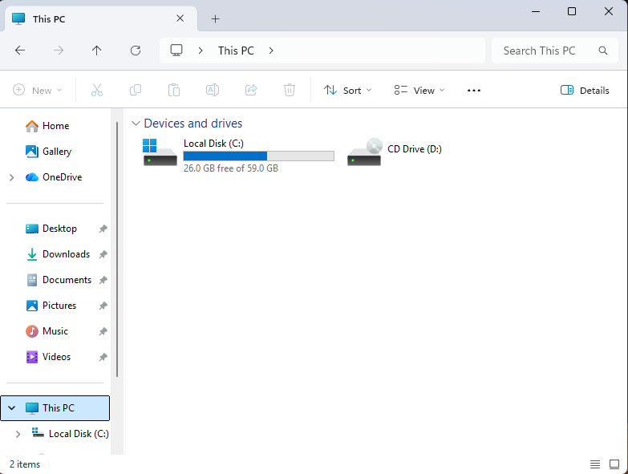
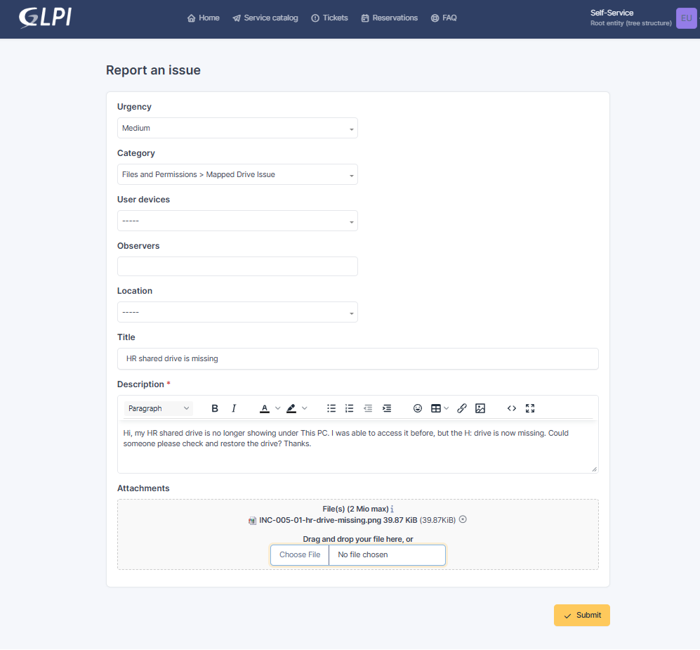
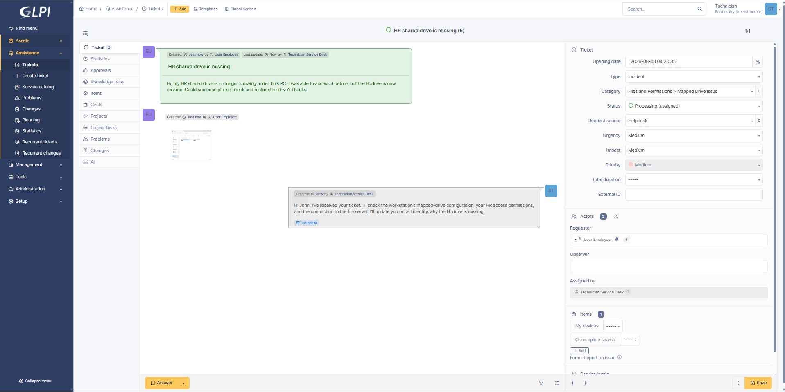
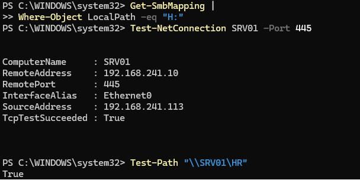
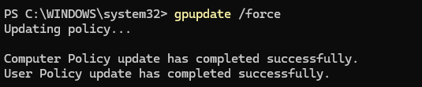
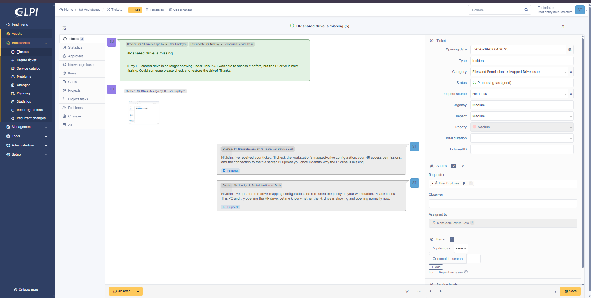
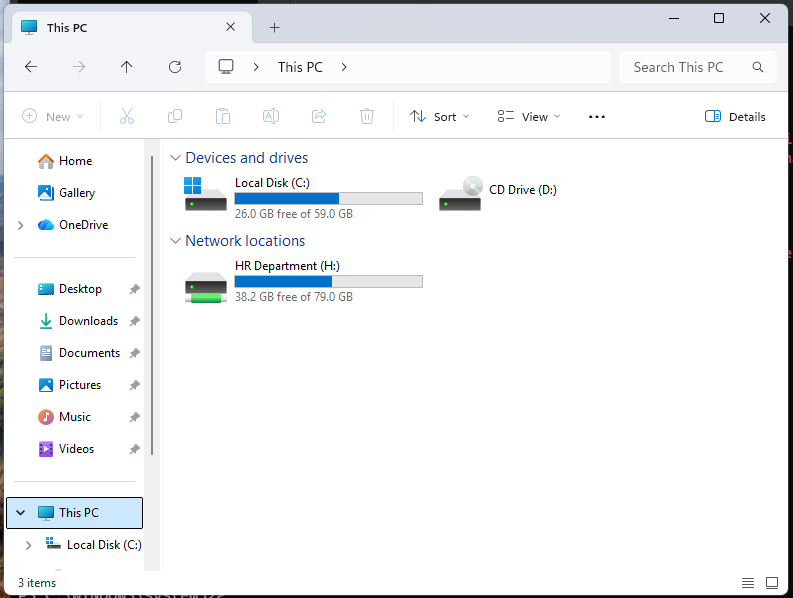
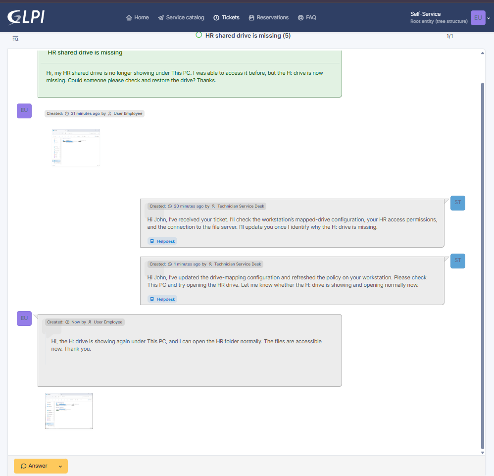
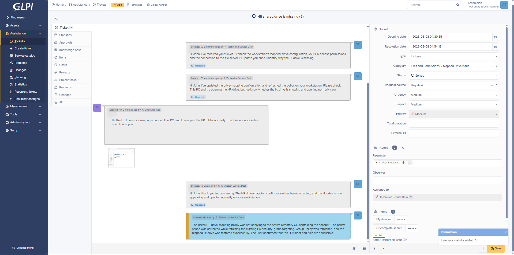
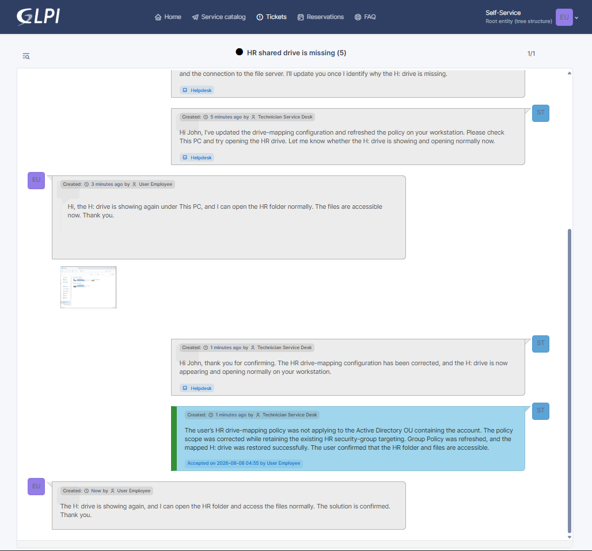

# INC-005 — Mapped HR Drive Missing

## Ticket Details

| Field | Value |
|---|---|
| Portfolio ID | INC-005 |
| GLPI Ticket ID | #5 |
| Ticket type | Incident |
| Category | Files and Permissions > Mapped Drive Issue |
| Status | Closed |
| Urgency | Medium |
| Impact | Medium |
| Priority | Medium |
| Support level | Level 1 |
| Requester | John Smith |
| Assigned technician | Service Desk Technician |
| Affected account | `john.smith` |
| Affected workstation | CLIENT01 |
| File server | SRV01 |
| Ticketing server | GLPI01 |
| Expected drive | `H:` |
| Shared folder | `\\SRV01\HR` |
| Drive-mapping policy | `HR Drive Mapping` |
| Required security group | `SG-HR-Users` |

---

## Issue Type

This was a mapped-drive configuration incident.

John Smith reported that the HR shared drive was no longer displayed under `This PC` on `CLIENT01`.

The HR share remained available on the file server, and the user still had permission to access it directly. The issue was limited to the Group Policy configuration responsible for creating the mapped `H:` drive.

---

## User-Reported Issue

John Smith opened `File Explorer → This PC` and found that the expected HR drive was missing.

The following mapped drive was expected:

```text
Drive letter : H:
Share path   : \\SRV01\HR
```



---

## User Report

John Smith submitted the following incident through GLPI:

> Hi, my HR shared drive is no longer showing under This PC. I was able to access it before, but the H: drive is now missing. Could someone please check and restore the drive? Thanks.



---

## Systems Involved

| System | Purpose |
|---|---|
| `CLIENT01` | Domain-joined workstation used by John Smith |
| `SRV01` | Active Directory and file server hosting the HR share |
| `GLPI01` | GLPI ticketing server |
| `HR Drive Mapping` | Group Policy used to create the mapped `H:` drive |
| `SG-HR-Users` | Security group used to target authorized HR users |

---

## Technician Acknowledgement

The ticket was assigned to the Service Desk Technician and moved to `Processing`.

> Hi John, I’ve received your ticket. I’ll check the workstation’s mapped-drive configuration, your HR access permissions, and the connection to the file server. I’ll update you once I identify why the H: drive is missing.



---

## Investigation

The technician first checked whether the `H:` drive was currently mapped on `CLIENT01`:

```powershell
Get-SmbMapping |
Where-Object LocalPath -eq "H:"
```

The command returned no result, confirming that the drive mapping was missing.

The connection to the file server was then tested:

```powershell
Test-NetConnection SRV01 -Port 445
```

The result showed:

```text
TcpTestSucceeded : True
```

This confirmed that the SMB file-sharing service on `SRV01` was reachable.

The HR share was also tested directly:

```powershell
Test-Path "\\SRV01\HR"
```

The result returned:

```text
True
```

This confirmed that:

- The file server was online.
- The HR shared folder was available.
- John Smith still had access to the share.
- The problem was limited to the missing drive mapping.



---

## Group Policy Investigation

A Group Policy refresh was initially attempted on `CLIENT01`:

```cmd
gpupdate /force
```

However, the `H:` drive did not return.

The user policy results were reviewed, and the `HR Drive Mapping` policy was not being applied to John Smith’s account.

John Smith’s Active Directory location was then checked:

```powershell
Get-ADUser -Identity "john.smith" |
Select-Object DistinguishedName
```

The account was located in:

```text
OU=Entra-Sync,DC=homelab,DC=local
```

The `HR Drive Mapping` Group Policy was linked only to:

```text
homelab.local/Company/HR
```

Because John Smith’s account was located in the `Entra-Sync` OU, the drive-mapping policy was outside the account’s Group Policy scope.

The existing drive-map item used item-level targeting for:

```text
HOMELAB\SG-HR-Users
```

This ensured that only authorized HR users would receive the mapped drive, even when the policy was made available to the `Entra-Sync` OU.

---

## Investigation Results

| Check | Result |
|---|---|
| `H:` drive currently mapped | No |
| File server reachable on SMB port 445 | Yes |
| HR share reachable directly | Yes |
| User permission to the HR share | Working |
| `HR Drive Mapping` GPO exists | Yes |
| User located in the HR OU | No |
| User located in the `Entra-Sync` OU | Yes |
| GPO applied to the user’s OU | No |
| Item-level security-group targeting configured | Yes |
| Root cause identified | Yes |

---

## Root Cause

The `HR Drive Mapping` Group Policy was linked only to the HR organizational unit.

John Smith’s account was located in the separate `Entra-Sync` OU, so the user was outside the scope of the drive-mapping policy.

The HR share and permissions were working correctly, but Windows did not receive the Group Policy preference required to create the mapped `H:` drive.

```text
John Smith located in Entra-Sync OU
                 ↓
HR Drive Mapping GPO linked only to HR OU
                 ↓
Drive-mapping policy not applied to the user
                 ↓
H: drive not created on CLIENT01
```

---

## Remediation

The existing `HR Drive Mapping` Group Policy was made available to the `Entra-Sync` OU.

The policy’s existing item-level targeting was retained:

```text
User must be a member of HOMELAB\SG-HR-Users
```

This ensured that the mapped HR drive would only be created for authorized users who were members of the required security group.

Group Policy was then refreshed on `CLIENT01`:

```cmd
gpupdate /force
```

John Smith signed out and signed back in so that the updated user policy could be applied.

The restored drive mapping was verified using:

```powershell
Get-SmbMapping |
Where-Object LocalPath -eq "H:" |
Select-Object LocalPath, RemotePath, Status
```

The result showed:

```text
LocalPath  : H:
RemotePath : \\SRV01\HR
Status     : OK
```



---

## Technician Request for Testing

After correcting the drive-mapping configuration, the technician asked John Smith to test the restored drive.

> Hi John, I’ve updated the drive-mapping configuration and refreshed the policy on your workstation. Please check This PC and try opening the HR drive. Let me know whether the H: drive is showing and opening normally now.



---

## Access Validation

John Smith opened:

```text
File Explorer → This PC
```

The mapped HR drive was visible again:

```text
H: → \\SRV01\HR
```

John opened the drive and confirmed that the HR folder and its files were accessible.



---

## User Confirmation

John Smith confirmed the restored drive through GLPI:

> Hi, the H: drive is showing again under This PC, and I can open the HR folder normally. The files are accessible now. Thank you.



---

## Technician Update

The technician acknowledged the successful test:

> Hi John, thank you for confirming. The HR drive-mapping configuration has been corrected, and the H: drive is now appearing and opening normally on your workstation.

---

## Official Solution

> The user’s HR drive-mapping policy was not applying to the Active Directory OU containing the account. The policy scope was corrected while retaining the existing HR security-group targeting. Group Policy was refreshed, and the mapped H: drive was restored successfully. The user confirmed that the HR folder and files are accessible.

The ticket status was changed to `Solved`.



---

## Ticket Closure

John Smith reviewed and accepted the solution.

The employee confirmed:

> The H: drive is showing again, and I can open the HR folder and access the files normally. The solution is confirmed. Thank you.

The ticket status was changed to `Closed`.



---

## Validation Results

| Validation check | Result |
|---|---|
| Missing `H:` drive confirmed | Passed |
| File server reachable on port 445 | Passed |
| HR share reachable directly | Passed |
| User permissions confirmed working | Passed |
| Drive-mapping GPO identified | Passed |
| User’s Active Directory OU identified | Passed |
| GPO scope issue identified | Passed |
| Security-group targeting retained | Passed |
| Group Policy refreshed | Passed |
| `H:` drive restored | Passed |
| HR folder opened successfully | Passed |
| Employee confirmed restored access | Passed |
| Ticket closed | Passed |

---

## Ticket Timeline

| Step | Action | Result |
|---:|---|---|
| 1 | John Smith checked `This PC` | `H:` drive was missing |
| 2 | John Smith submitted Ticket #5 | Incident recorded |
| 3 | Technician accepted and acknowledged the ticket | Ticket moved to Processing |
| 4 | Existing SMB mappings were checked | `H:` mapping not found |
| 5 | File server connectivity was tested | SMB service reachable |
| 6 | HR share was tested directly | Share and permissions working |
| 7 | Group Policy refresh was attempted | Drive remained missing |
| 8 | User policy and OU placement were reviewed | GPO scope issue found |
| 9 | Drive-mapping policy scope was corrected | Policy made available to the user |
| 10 | Existing security-group targeting was retained | Access remained limited to authorized users |
| 11 | Group Policy was refreshed | Updated policy processed |
| 12 | John Smith signed out and back in | User policy reapplied |
| 13 | `H:` drive mapping was verified | Mapping status returned `OK` |
| 14 | John Smith opened the HR drive | Folder access restored |
| 15 | Employee confirmed the fix | Validation completed |
| 16 | Technician recorded the official solution | Ticket moved to Solved |
| 17 | Employee accepted the solution | Ticket closed |

---

## Closure

| Closure check | Result |
|---|---|
| Incident investigated | Yes |
| File server connectivity confirmed | Yes |
| Share permissions confirmed | Yes |
| Group Policy configuration reviewed | Yes |
| Root cause identified | Yes |
| Drive-mapping scope corrected | Yes |
| Security-group targeting retained | Yes |
| Group Policy refreshed | Yes |
| Mapped drive restored | Yes |
| Employee confirmation received | Yes |
| Official solution recorded | Yes |
| Ticket closed | Yes |

---

## How the Issue Was Resolved

John Smith reported that the mapped `H:` drive was no longer visible under `This PC`.

I confirmed that the drive mapping was missing, but the file server and HR shared folder were still reachable. This showed that the problem was not caused by a server outage or missing folder permissions.

I reviewed the drive-mapping Group Policy and found that it was linked only to the HR OU, while John Smith’s account was located in the `Entra-Sync` OU. Because of this, the policy responsible for creating the `H:` drive was not applying to his account.

The policy scope was corrected while keeping the existing `SG-HR-Users` item-level targeting in place. I refreshed Group Policy on `CLIENT01`, asked John to sign out and back in, and verified that the `H:` drive returned with an `OK` status.

John then opened the HR drive and confirmed that the folder and files were accessible again.

---

## Technician Insight

I first separated the drive-mapping issue from a file-server or permission problem. The server was reachable, and John could access the HR share directly, so the missing drive was caused by how the mapping was being delivered to the workstation.

Reviewing the user’s Active Directory location showed that the account was stored in the `Entra-Sync` OU, while the drive-mapping policy was linked only to the HR OU. This explained why manually refreshing Group Policy did not initially restore the drive.

Before adjusting the policy scope, I confirmed that item-level targeting was already limiting the drive to members of `SG-HR-Users`. This allowed the policy to reach the user’s OU without mapping the HR drive for unauthorized accounts.

I asked John to test the drive after the policy refresh and closed the incident only after he confirmed that the drive and files were accessible.

---

## Evidence Files

```text
images/INC-005-01-hr-drive-missing.png
images/INC-005-02-ticket-submitted.png
images/INC-005-03-ticket-assigned-and-acknowledged.png
images/INC-005-04-mapped-drive-investigation.png
images/INC-005-05-group-policy-refreshed.png
images/INC-005-06-technician-requested-user-testing.png
images/INC-005-07-hr-drive-access-confirmed.png
images/INC-005-08-user-confirmed-drive-restored.png
images/INC-005-09-ticket-solved.png
images/INC-005-10-ticket-closed.png
```

---

## Final Status

```text
Portfolio ID              : INC-005
GLPI Ticket ID            : #5
Ticket type               : Incident
Issue                     : Mapped HR Drive Missing
Affected account          : john.smith
Affected workstation      : CLIENT01
Expected drive            : H:
Shared folder             : \\SRV01\HR
Drive-mapping policy      : HR Drive Mapping
Required security group   : SG-HR-Users
Root cause                : GPO not scoped to the user's OU
Policy scope corrected    : Yes
Security targeting retained: Yes
Mapped drive restored     : Yes
User confirmed            : Yes
Final status              : CLOSED
```
