# INC-006 — Network Printer Missing

## Ticket Details

| Field | Value |
|---|---|
| Portfolio ID | INC-006 |
| GLPI Ticket ID | #6 |
| Ticket type | Incident |
| Category | Hardware and Peripherals > Printer Issue |
| Status | Closed |
| Urgency | Medium |
| Impact | Medium |
| Priority | Medium |
| Support level | Level 1 |
| Requester | John Smith |
| Assigned technician | Service Desk Technician |
| Affected account | `john.smith` |
| Affected workstation | CLIENT01 |
| Print server | SRV01 |
| Ticketing server | GLPI01 |
| Printer connection | `\\SRV01\HR-Printer` |
| Printer deployment policy | `Workstation - Printer Deployment` |
| Required security group | `SG-HR-Users` |

---

## Issue Type

This was a network-printer deployment incident.

John Smith reported that the HR network printer was no longer displayed on `CLIENT01`.

The shared printer remained available on the print server, but the Group Policy responsible for deploying the printer was not applying to the Active Directory OU containing John Smith’s account.

---

## Initial Working State

Before the incident, the HR printer was installed on `CLIENT01` as a shared printer connection:

```text
\\SRV01\HR-Printer
```

The installed printer was confirmed using:

```powershell
Get-Printer |
Select-Object Name, Type, DriverName, PortName
```

The result showed:

```text
Name       : \\SRV01\HR-Printer
Type       : Connection
DriverName : Generic / Text Only
```

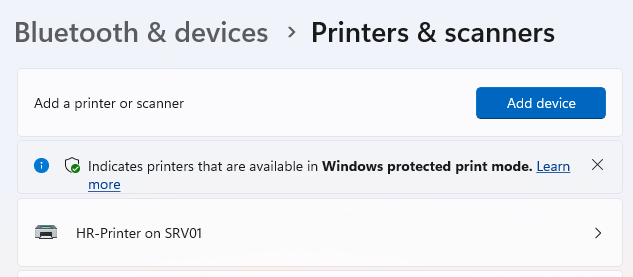

---

## User-Reported Issue

John Smith opened:

```text
Settings → Bluetooth & devices → Printers & scanners
```

The HR network printer was no longer listed.

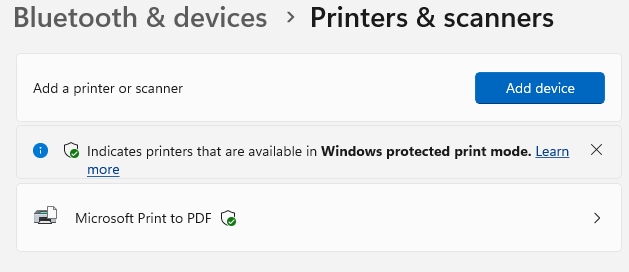

---

## User Report

John Smith submitted the following incident through GLPI:

> Hi, the HR network printer is no longer showing on my workstation. I was able to use it before, but it is now missing from the printer list. Could someone please check and restore it? Thanks.

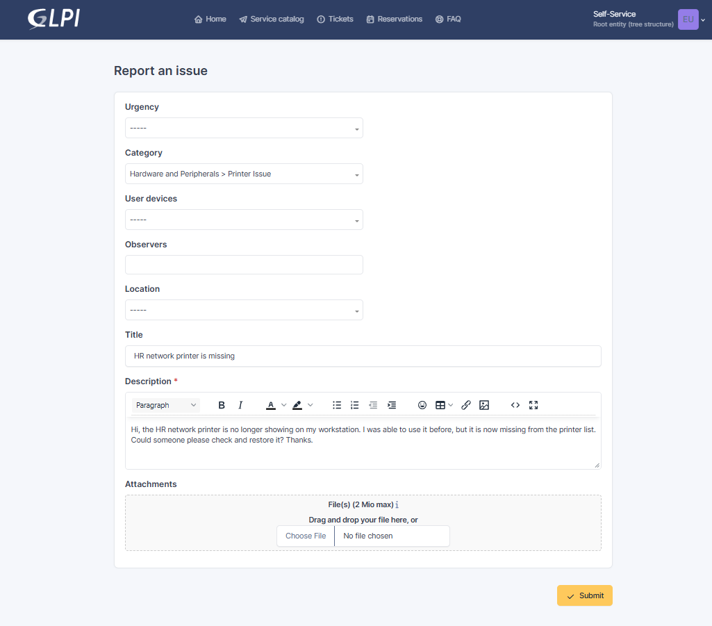

---

## Systems Involved

| System | Purpose |
|---|---|
| `CLIENT01` | Domain-joined workstation used by John Smith |
| `SRV01` | Print server hosting the shared HR printer |
| `GLPI01` | GLPI ticketing server |
| `Workstation - Printer Deployment` | Group Policy used to deploy the printer |
| `SG-HR-Users` | Security group used to target authorized HR users |

---

## Technician Acknowledgement

The ticket was assigned to the Service Desk Technician and moved to `Processing`.

> Hi John, I’ve received your ticket. I’ll check the printer deployment, your connection to the print server, and whether the HR printer policy is applying correctly to your workstation. I’ll update you once I identify the cause.

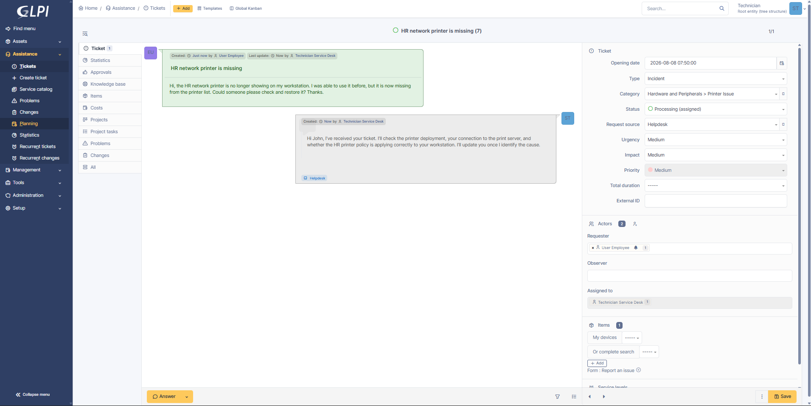

---

## Investigation

The technician first checked whether the HR printer connection existed on `CLIENT01`:

```powershell
Get-Printer |
Where-Object Name -eq "\\SRV01\HR-Printer" |
Select-Object Name, Type, DriverName, PortName
```

The command returned no result, confirming that the printer connection was missing.

The connection to the print server was then tested:

```powershell
Test-NetConnection SRV01 -Port 445
```

The result showed:

```text
TcpTestSucceeded : True
```

This confirmed that the workstation could reach the file and print server over SMB.

The shared printer was checked directly on `SRV01`:

```powershell
Get-Printer -ComputerName SRV01 |
Where-Object Name -eq "HR-Printer" |
Select-Object Name, Shared, ShareName, DriverName
```

The printer was available and shared as:

```text
Name      : HR-Printer
Shared    : True
ShareName : HR-Printer
```

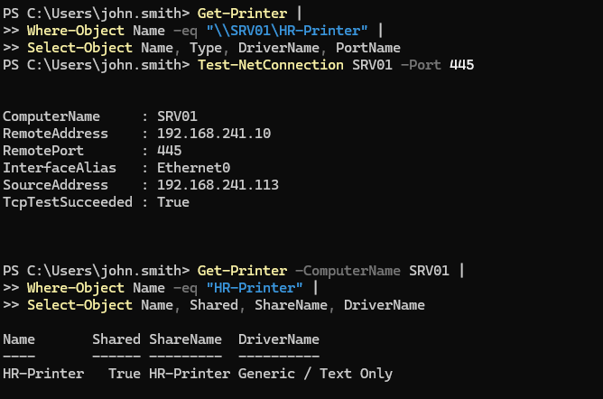

---

## Group Policy Investigation

The printer deployment Group Policy was identified using:

```powershell
Get-GPO -All |
Where-Object DisplayName -match "Printer|Print" |
Select-Object DisplayName, GpoStatus
```

The relevant policy was:

```text
Workstation - Printer Deployment
```

The policy link was reviewed using:

```powershell
[xml]$printerGpo = Get-GPOReport `
  -Name "Workstation - Printer Deployment" `
  -ReportType Xml

$printerGpo.GPO.LinksTo |
Select-Object SOMPath, Enabled, NoOverride
```

The policy was linked only to:

```text
homelab.local/Company/HR
```

John Smith’s Active Directory account was located in:

```text
CN=John Smith,OU=Entra-Sync,DC=homelab,DC=local
```

Because the account was located in the `Entra-Sync` OU, the printer deployment policy was outside the user’s Group Policy scope.

The printer preference item was also reviewed and found to have no item-level targeting configured.

Before extending the policy scope, item-level targeting was added to restrict the printer deployment to:

```text
HOMELAB\SG-HR-Users
```

---

## Investigation Results

| Check | Result |
|---|---|
| HR printer connection present on CLIENT01 | No |
| Print server reachable on port 445 | Yes |
| Shared printer available on SRV01 | Yes |
| Printer deployment GPO exists | Yes |
| GPO linked to HR OU | Yes |
| User located in HR OU | No |
| User located in `Entra-Sync` OU | Yes |
| GPO applied to user’s OU | No |
| Item-level targeting originally configured | No |
| Required HR targeting added | Yes |
| Root cause identified | Yes |

---

## Root Cause

The `Workstation - Printer Deployment` Group Policy was linked only to the HR organizational unit.

John Smith’s account was located in the separate `Entra-Sync` OU, so the printer deployment policy did not apply to his user account.

The shared printer and print server were working correctly, but Windows did not receive the policy preference required to create the printer connection.

```text
John Smith located in Entra-Sync OU
                   ↓
Printer GPO linked only to HR OU
                   ↓
Printer deployment policy not applied
                   ↓
HR network printer missing from CLIENT01
```

---

## Remediation

Item-level targeting was added to the shared printer preference:

```text
User must be a member of HOMELAB\SG-HR-Users
```

This ensured that only authorized HR users would receive the printer connection.

The existing printer deployment policy was then linked to the `Entra-Sync` OU.

Group Policy was refreshed on `CLIENT01`:

```cmd
gpupdate /force
```

John Smith signed out and signed back in so that the updated user policy could be applied.

The restored printer connection was verified using:

```powershell
Get-Printer |
Where-Object Name -eq "\\SRV01\HR-Printer" |
Select-Object Name, Type, DriverName, PortName
```

The result showed:

```text
Name       : \\SRV01\HR-Printer
Type       : Connection
DriverName : Generic / Text Only
```

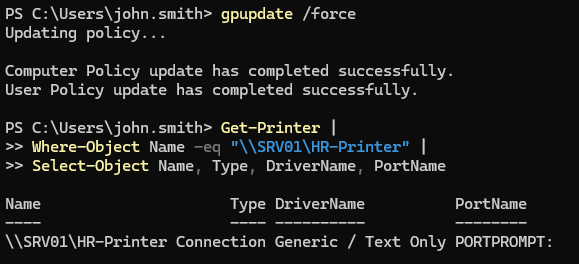

---

## Technician Request for Testing

After correcting the printer deployment configuration, the technician asked John Smith to test the restored printer.

> Hi John, I’ve updated the printer deployment settings and refreshed Group Policy on your workstation. Please check Printers & scanners and confirm whether the HR printer is showing again. Please also try opening the printer queue and let me know if it appears normally.

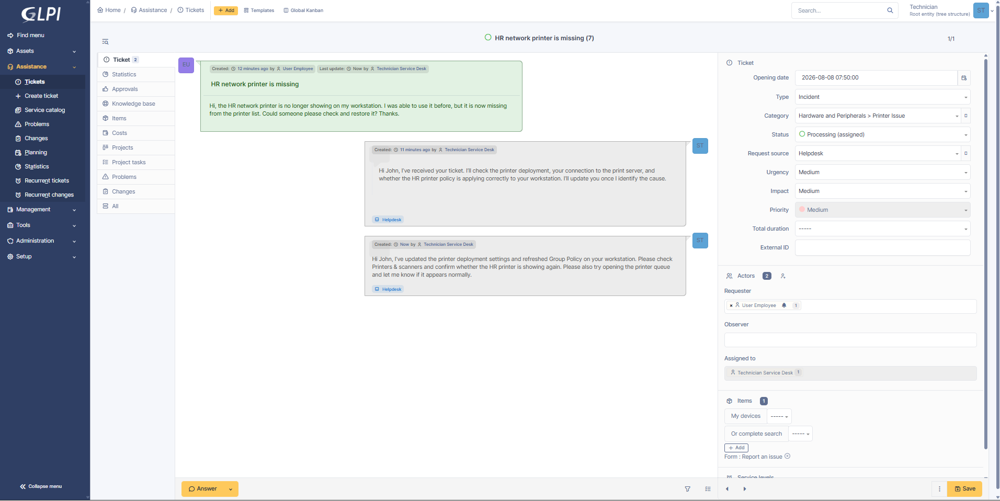

---

## Access Validation

John Smith opened:

```text
Settings → Bluetooth & devices → Printers & scanners
```

The shared HR printer was visible again:

```text
\\SRV01\HR-Printer
```

John selected the printer and successfully opened the printer queue.

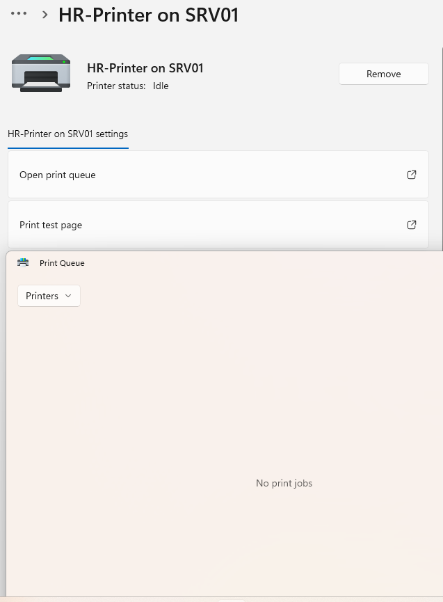

---

## User Confirmation

John Smith confirmed the restored printer through GLPI:

> Hi, the HR printer is showing again, and I can open the printer queue normally. It looks like the printer connection has been restored. Thank you.

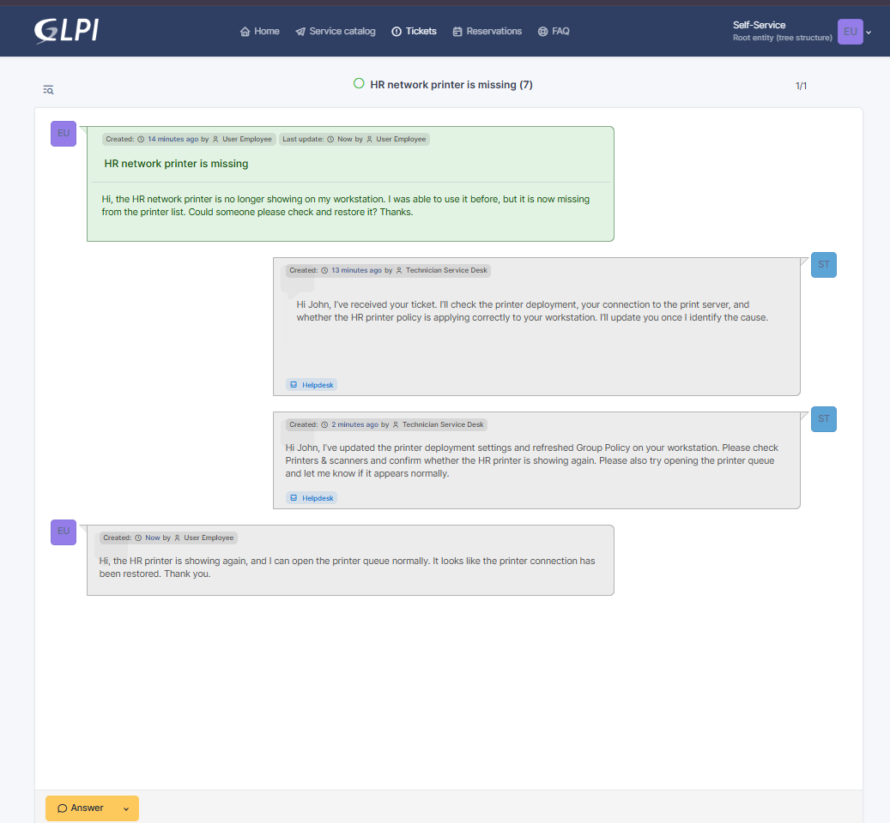

---

## Technician Update

The technician acknowledged the successful test:

> Hi John, thank you for confirming. The HR printer deployment has been corrected, and the printer is now showing and opening normally on your workstation.

---

## Official Solution

> The HR printer deployment policy was not applying to the Active Directory OU containing the user account. Item-level targeting was added to restrict deployment to members of `SG-HR-Users`, and the printer policy was linked to the user’s OU. Group Policy was refreshed, and the `\\SRV01\HR-Printer` connection was restored successfully. The user confirmed that the printer queue opens normally.

The ticket status was changed to `Solved`.

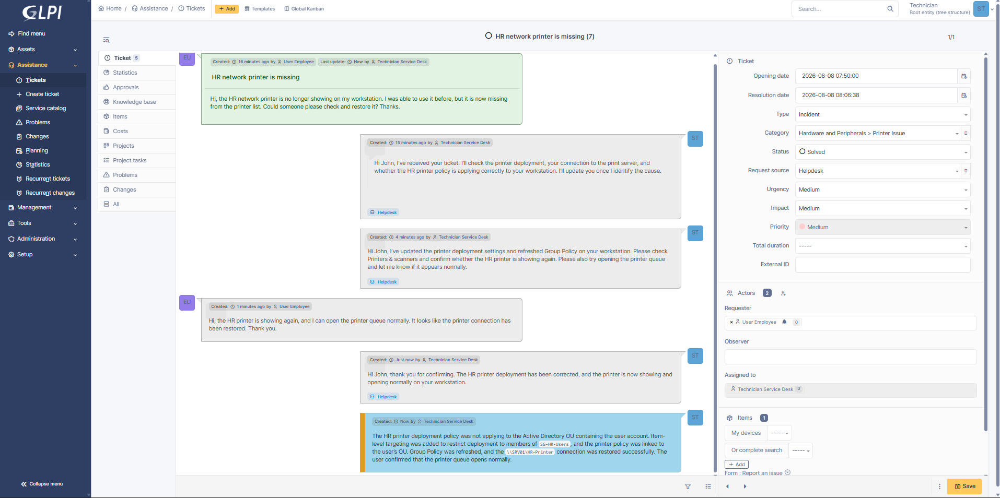

---

## Ticket Closure

John Smith reviewed and accepted the solution.

The employee confirmed:

> The HR printer is showing again, and I can open the printer queue normally. The solution is confirmed. Thank you.

The ticket status was changed to `Closed`.

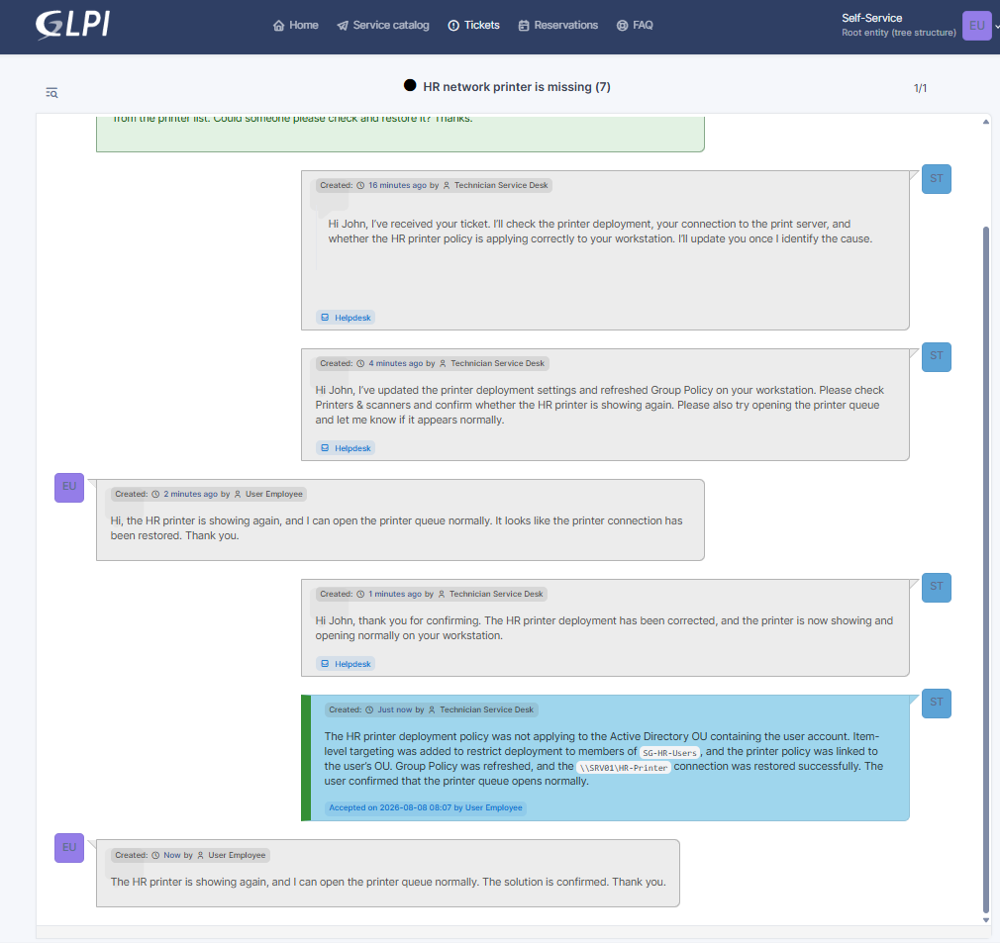

---

## Validation Results

| Validation check | Result |
|---|---|
| Missing printer confirmed | Passed |
| Print server reachable on port 445 | Passed |
| Shared printer available on SRV01 | Passed |
| Printer deployment GPO identified | Passed |
| User’s Active Directory OU identified | Passed |
| GPO scope issue identified | Passed |
| HR security-group targeting added | Passed |
| Printer GPO linked to user’s OU | Passed |
| Group Policy refreshed | Passed |
| User session refreshed | Passed |
| Printer connection restored | Passed |
| Printer queue opened successfully | Passed |
| Employee confirmed restored access | Passed |
| Ticket closed | Passed |

---

## Ticket Timeline

| Step | Action | Result |
|---:|---|---|
| 1 | John Smith checked the printer list | HR printer was missing |
| 2 | John Smith submitted Ticket #6 | Incident recorded |
| 3 | Technician accepted and acknowledged the ticket | Ticket moved to Processing |
| 4 | Printer connections were reviewed on CLIENT01 | HR printer not found |
| 5 | Print-server connectivity was tested | Server reachable |
| 6 | Shared printer was checked on SRV01 | Printer available |
| 7 | Printer deployment GPO was identified | Policy found |
| 8 | GPO link location was reviewed | Policy linked only to HR OU |
| 9 | John Smith’s OU was checked | Account located in Entra-Sync |
| 10 | Printer preference targeting was reviewed | No targeting configured |
| 11 | Item-level targeting was added | Deployment restricted to HR users |
| 12 | Printer GPO was linked to Entra-Sync | Policy made available to the user |
| 13 | Group Policy was refreshed | Updated policy processed |
| 14 | John Smith signed out and back in | User policy reapplied |
| 15 | Printer connection was verified | Printer restored |
| 16 | Technician requested user testing | Validation requested |
| 17 | John opened the printer queue | Printer connection working |
| 18 | Employee confirmed the fix | Validation completed |
| 19 | Technician recorded the solution | Ticket moved to Solved |
| 20 | Employee accepted the solution | Ticket closed |

---

## Closure

| Closure check | Result |
|---|---|
| Incident investigated | Yes |
| Print server connectivity confirmed | Yes |
| Shared printer availability confirmed | Yes |
| Group Policy configuration reviewed | Yes |
| Root cause identified | Yes |
| Security-group targeting configured | Yes |
| Printer policy scope corrected | Yes |
| Group Policy refreshed | Yes |
| Printer connection restored | Yes |
| Employee confirmation received | Yes |
| Official solution recorded | Yes |
| Ticket closed | Yes |

---

## How the Issue Was Resolved

John Smith reported that the HR network printer was no longer visible on his workstation.

I confirmed that the printer connection was missing from `CLIENT01`, but the print server was reachable and the shared `HR-Printer` was still available on `SRV01`. This showed that the issue was related to printer deployment rather than a print-server outage.

I reviewed the `Workstation - Printer Deployment` Group Policy and found that it was linked only to the HR OU, while John Smith’s account was located in the `Entra-Sync` OU. I also found that the printer preference did not have item-level targeting.

I added targeting for members of `SG-HR-Users`, linked the printer policy to the user’s OU, and refreshed Group Policy on the workstation.

After John signed out and back in, the printer connection returned. He opened the printer queue successfully and confirmed that the printer was working normally.

---

## Technician Insight

I first confirmed whether the problem was with the print server or only the user’s printer connection. Since the server was reachable and the printer was still shared, I focused on how the printer was being deployed to the workstation.

The user’s account was outside the OU where the printer policy was linked. Before extending the policy to another OU, I added item-level targeting so that only members of the HR security group would receive the printer.

This prevented the HR printer from being deployed to unrelated users in the `Entra-Sync` OU.

After refreshing the policy, I asked John to open the printer queue instead of only checking whether the printer appeared. This provided stronger confirmation that the connection was usable before the ticket was closed.

---

## Evidence Files

```text
images/INC-006-01-printer-working-baseline.png
images/INC-006-02-network-printer-missing.png
images/INC-006-03-ticket-submitted.png
images/INC-006-04-ticket-assigned-and-acknowledged.png
images/INC-006-05-printer-investigation.png
images/INC-006-06-printer-restored-after-gpo-refresh.png
images/INC-006-07-technician-requested-user-testing.png
images/INC-006-08-hr-printer-access-confirmed.png
images/INC-006-09-user-confirmed-printer-restored.png
images/INC-006-10-ticket-solved.png
images/INC-006-11-ticket-closed.png
```

---

## Final Status

```text
Portfolio ID               : INC-006
GLPI Ticket ID             : #6
Ticket type                : Incident
Issue                      : Network Printer Missing
Affected account           : john.smith
Affected workstation       : CLIENT01
Printer connection         : \\SRV01\HR-Printer
Printer deployment policy  : Workstation - Printer Deployment
Required security group    : SG-HR-Users
Root cause                 : Printer GPO not scoped to the user's OU
Item-level targeting added : Yes
Policy scope corrected     : Yes
Printer restored           : Yes
User confirmed             : Yes
Final status               : CLOSED
```
