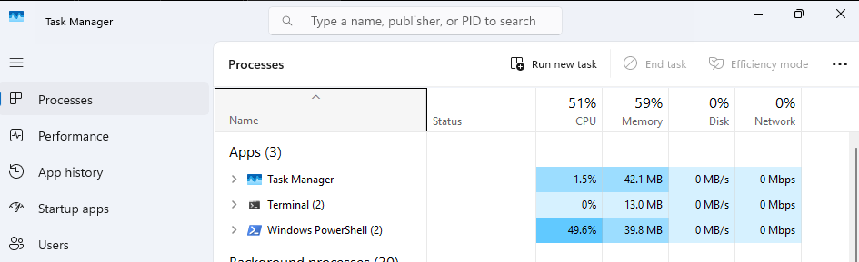
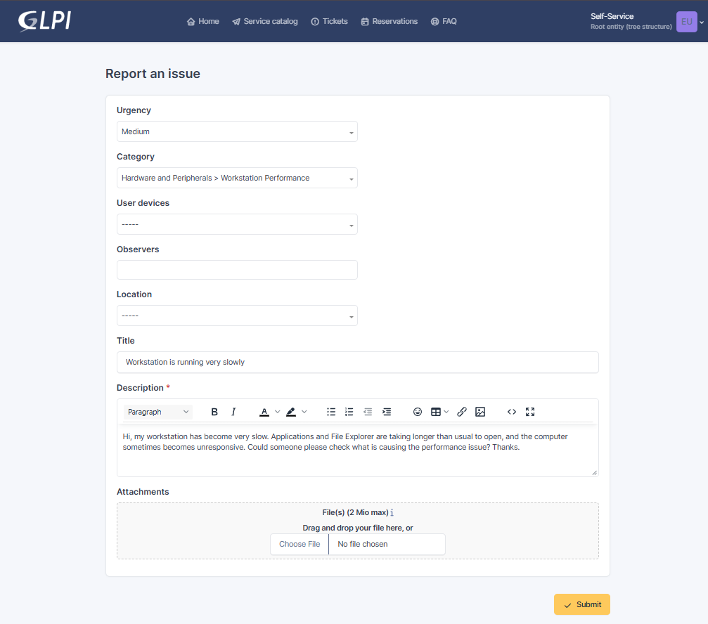
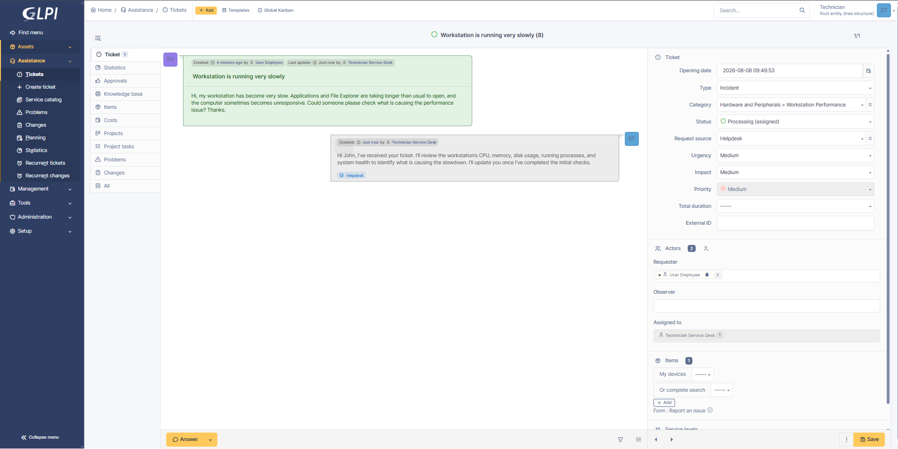
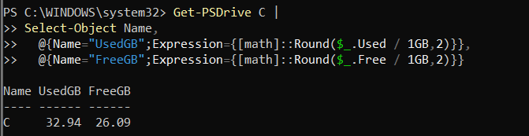
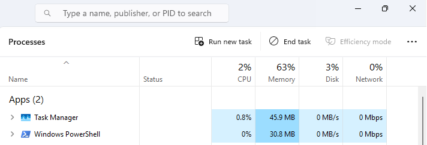
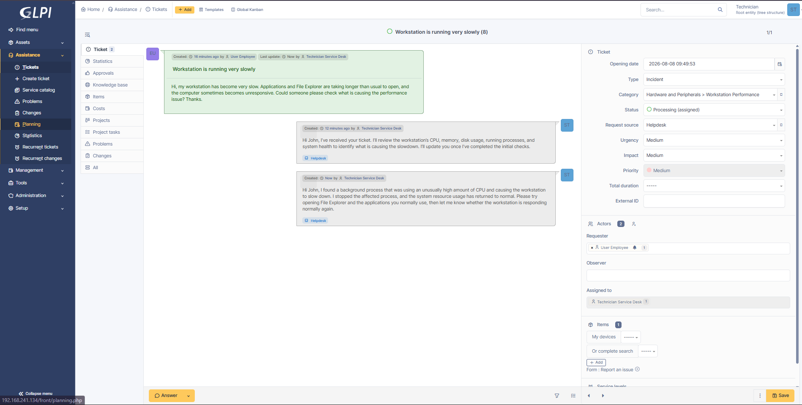
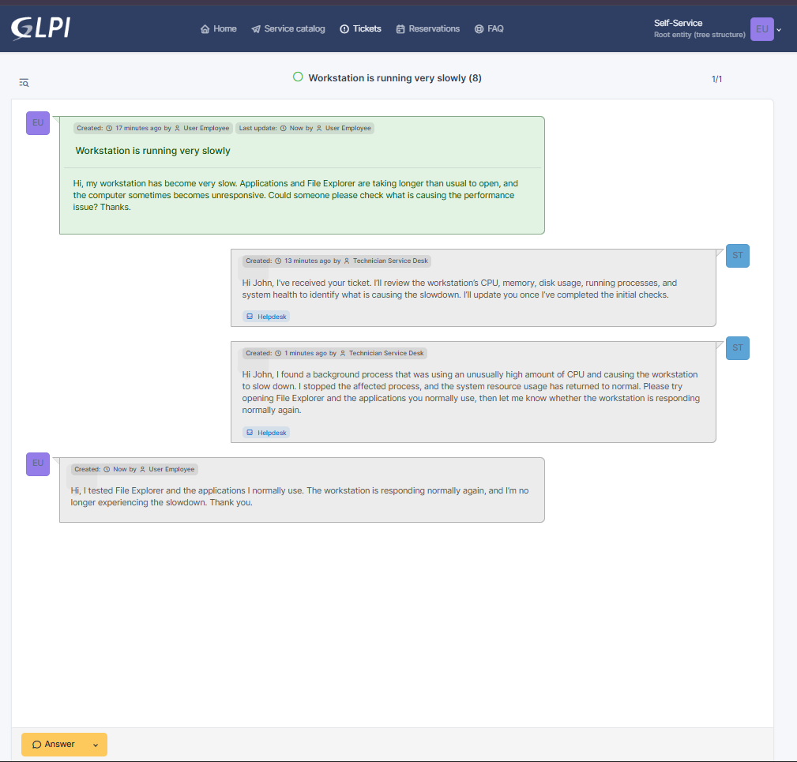
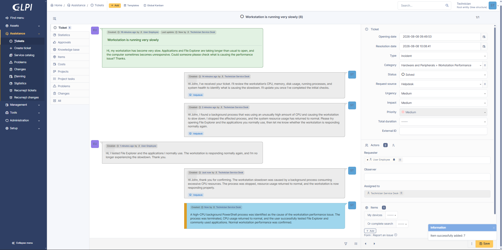
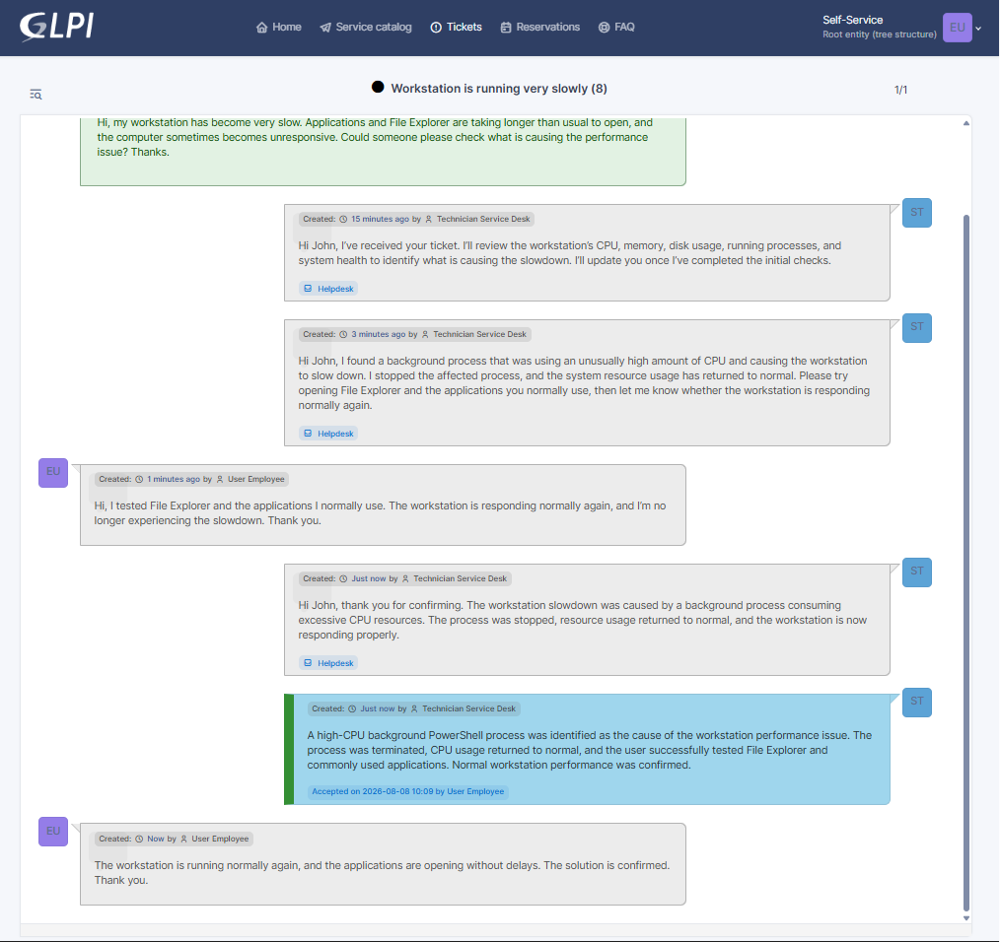

# INC-007 — Slow Workstation Performance

## Ticket Details

| Field | Value |
|---|---|
| Portfolio ID | INC-007 |
| GLPI Ticket ID | #7 |
| Ticket type | Incident |
| Category | Hardware and Peripherals > Workstation Performance |
| Status | Closed |
| Urgency | Medium |
| Impact | Medium |
| Priority | Medium |
| Support level | Level 1 |
| Requester | John Smith |
| Assigned technician | Service Desk Technician |
| Affected account | `john.smith` |
| Affected workstation | CLIENT01 |
| Ticketing server | GLPI01 |
| Affected service | Windows workstation performance |

---

## Issue Type

This was a workstation-performance incident.

John Smith reported that `CLIENT01` had become slow and occasionally unresponsive. File Explorer and commonly used applications were taking longer than normal to open.

The issue affected one workstation and reduced the employee’s ability to complete normal work efficiently.

---

## User-Reported Issue

Task Manager showed elevated processor usage while the workstation was responding slowly.

A background PowerShell process was consuming a noticeable amount of CPU resources.



---

## User Report

John Smith submitted the following incident through GLPI:

> Hi, my workstation has become very slow. Applications and File Explorer are taking longer than usual to open, and the computer sometimes becomes unresponsive. Could someone please check what is causing the performance issue? Thanks.



---

## Systems Involved

| System | Purpose |
|---|---|
| `CLIENT01` | Windows workstation experiencing the performance issue |
| `GLPI01` | GLPI ticketing server used to manage the incident |
| `SRV01` | Active Directory infrastructure supporting the domain environment |

---

## Technician Acknowledgement

The ticket was assigned to the Service Desk Technician and moved to `Processing`.

> Hi John, I’ve received your ticket. I’ll review the workstation’s CPU, memory, disk usage, running processes, and system health to identify what is causing the slowdown. I’ll update you once I’ve completed the initial checks.



---

## Investigation

The running processes on `CLIENT01` were sorted by accumulated CPU usage:

```powershell
Get-Process |
Sort-Object CPU -Descending |
Select-Object -First 10 `
  ProcessName,
  Id,
  @{Name="CPUSeconds";Expression={[math]::Round($_.CPU,2)}},
  @{Name="MemoryMB";Expression={[math]::Round($_.WorkingSet64 / 1MB,2)}}
```

A PowerShell process appeared near the top of the results and had accumulated an unusually high amount of processor time.

Current processor, memory, and disk activity were then reviewed:

```powershell
Get-Counter `
  '\Processor(_Total)\% Processor Time',
  '\Memory\% Committed Bytes In Use',
  '\PhysicalDisk(_Total)\% Disk Time' `
  -SampleInterval 1 `
  -MaxSamples 3
```

The results showed that processor usage was elevated while memory and disk activity did not indicate a similar resource shortage.

Available storage on the Windows system drive was also checked:

```powershell
Get-PSDrive C |
Select-Object Name,
  @{Name="UsedGB";Expression={[math]::Round($_.Used / 1GB,2)}},
  @{Name="FreeGB";Expression={[math]::Round($_.Free / 1GB,2)}}
```

The system drive still had free space available, eliminating low storage as the primary cause.



---

## Investigation Results

| Check | Result |
|---|---|
| Workstation slowdown confirmed | Yes |
| CPU usage elevated | Yes |
| High-CPU process identified | Yes |
| Process type | PowerShell |
| Memory exhaustion identified | No |
| Excessive disk activity identified | No |
| Low system-drive space identified | No |
| Root cause isolated | Yes |

---

## Root Cause

A background PowerShell process was continuously consuming excessive CPU resources.

The process reduced the processor capacity available to Windows, File Explorer, and the employee’s applications. This caused slower application launches and periods of poor workstation responsiveness.

```text
Background PowerShell process running
                 ↓
Excessive CPU resources consumed
                 ↓
Fewer resources available to applications
                 ↓
File Explorer and applications respond slowly
```

There was no indication that low disk space, memory exhaustion, or a file-server problem caused the incident.

---

## Remediation

The process ID of the high-CPU PowerShell process was identified from the process investigation.

The affected process was terminated using:

```powershell
Stop-Process -Id <PROCESS-ID> -Force
```

The process was checked again to verify that it was no longer running:

```powershell
Get-Process -Id <PROCESS-ID> -ErrorAction SilentlyContinue
```

The command returned no result, confirming that the process had stopped.

Processor usage was then measured again:

```powershell
Get-Counter '\Processor(_Total)\% Processor Time' `
  -SampleInterval 1 `
  -MaxSamples 5
```

Task Manager was also reviewed to confirm that:

- The affected process was no longer running.
- Processor usage had returned to a normal level.
- The workstation was responding more quickly.



---

## Technician Request for Testing

After stopping the affected process and confirming that resource usage had returned to normal, the technician asked John Smith to test the workstation.

> Hi John, I found a background process that was using an unusually high amount of CPU and causing the workstation to slow down. I stopped the affected process, and the system resource usage has returned to normal. Please try opening File Explorer and the applications you normally use, then let me know whether the workstation is responding normally again.



---

## User Validation

John Smith tested:

- File Explorer
- Commonly used applications
- General workstation responsiveness

The employee confirmed through GLPI:

> Hi, I tested File Explorer and the applications I normally use. The workstation is responding normally again, and I’m no longer experiencing the slowdown. Thank you.



---

## Technician Update

The technician acknowledged the successful test:

> Hi John, thank you for confirming. The workstation slowdown was caused by a background process consuming excessive CPU resources. The process was stopped, resource usage returned to normal, and the workstation is now responding properly.

---

## Official Solution

> A high-CPU background PowerShell process was identified as the cause of the workstation performance issue. The process was terminated, CPU usage returned to normal, and the user successfully tested File Explorer and commonly used applications. Normal workstation performance was confirmed.

The ticket status was changed to `Solved`.



---

## Ticket Closure

John Smith reviewed and accepted the solution.

The employee confirmed:

> The workstation is running normally again, and the applications are opening without delays. The solution is confirmed. Thank you.

The ticket status was changed to `Closed`.



---

## Validation Results

| Validation check | Result |
|---|---|
| Workstation slowdown reproduced and observed | Passed |
| CPU usage reviewed | Passed |
| Running processes analyzed | Passed |
| High-CPU process identified | Passed |
| Memory usage reviewed | Passed |
| Disk activity reviewed | Passed |
| System-drive space checked | Passed |
| Affected process terminated | Passed |
| Process termination verified | Passed |
| CPU usage returned to normal | Passed |
| File Explorer tested successfully | Passed |
| Common applications tested successfully | Passed |
| Employee confirmed normal performance | Passed |
| Ticket closed | Passed |

---

## Ticket Timeline

| Step | Action | Result |
|---:|---|---|
| 1 | John Smith experienced slow workstation performance | Productivity affected |
| 2 | Task Manager was reviewed | Elevated CPU usage observed |
| 3 | John Smith submitted Ticket #7 | Incident recorded |
| 4 | Technician accepted and acknowledged the ticket | Ticket moved to Processing |
| 5 | Running processes were sorted by CPU usage | High-CPU PowerShell process identified |
| 6 | Processor, memory, and disk activity were checked | CPU identified as the affected resource |
| 7 | System-drive capacity was checked | Sufficient free space available |
| 8 | Root cause was confirmed | Background process consuming excessive CPU |
| 9 | Affected process was terminated | CPU resource consumption stopped |
| 10 | Processor usage was checked again | Usage returned to normal |
| 11 | Technician requested employee testing | Validation requested |
| 12 | John tested File Explorer and applications | Normal responsiveness confirmed |
| 13 | Technician recorded the official solution | Ticket moved to Solved |
| 14 | Employee accepted the solution | Ticket closed |

---

## Closure

| Closure check | Result |
|---|---|
| Incident investigated | Yes |
| System-resource usage reviewed | Yes |
| Root cause identified | Yes |
| High-CPU process terminated | Yes |
| CPU usage normalized | Yes |
| Workstation responsiveness restored | Yes |
| Employee confirmation received | Yes |
| Technician update recorded | Yes |
| Official solution recorded | Yes |
| Ticket closed | Yes |

---

## How the Issue Was Resolved

John Smith reported that File Explorer and other applications were opening slowly and that the workstation sometimes became unresponsive.

I reviewed the running processes and found a background PowerShell process consuming an unusually high amount of processor time. I also checked memory usage, disk activity, and free storage to determine whether another system resource was causing the slowdown.

The memory, disk, and storage checks did not indicate a significant problem, so I isolated the issue to the high-CPU PowerShell process.

I terminated the affected process and verified that it was no longer running. I then measured CPU usage again and confirmed that it had returned to a normal level.

John tested File Explorer and his commonly used applications and confirmed that the workstation was responding normally again.

---

## Technician Insight

I avoided assuming that the workstation needed more memory, additional storage, or a restart without first reviewing the resource usage.

Sorting the running processes by CPU time helped identify which process was consuming the most processor resources. Checking memory, disk activity, and available storage also helped eliminate other common causes of slow workstation performance.

After terminating the affected process, I did not rely only on Task Manager. I asked the employee to test the applications involved in the original complaint. This confirmed that the technical improvement also resolved the employee’s actual experience before the incident was closed.

---

## Evidence Files

```text
images/INC-007-01-high-cpu-usage-observed.png
images/INC-007-02-ticket-submitted.png
images/INC-007-03-ticket-assigned-and-acknowledged.png
images/INC-007-04-performance-investigation.png
images/INC-007-05-high-cpu-process-terminated.png
images/INC-007-06-technician-requested-performance-testing.png
images/INC-007-07-user-confirmed-performance-restored.png
images/INC-007-08-ticket-solved.png
images/INC-007-09-ticket-closed.png
```

---

## Final Status

```text
Portfolio ID          : INC-007
GLPI Ticket ID        : #7
Ticket type           : Incident
Issue                 : Slow Workstation Performance
Affected user         : John Smith
Affected workstation  : CLIENT01
Root cause            : Background process consuming excessive CPU
High-CPU process      : PowerShell
Process terminated    : Yes
CPU usage normalized  : Yes
Performance restored  : Yes
User confirmed        : Yes
Final status          : CLOSED
```
