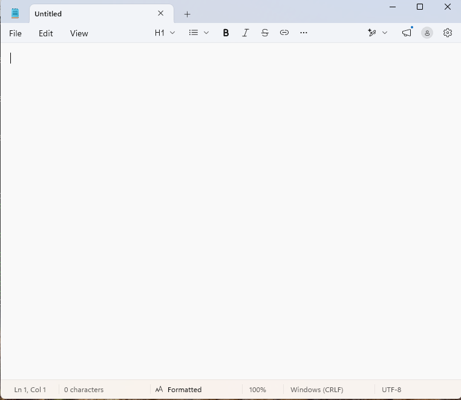
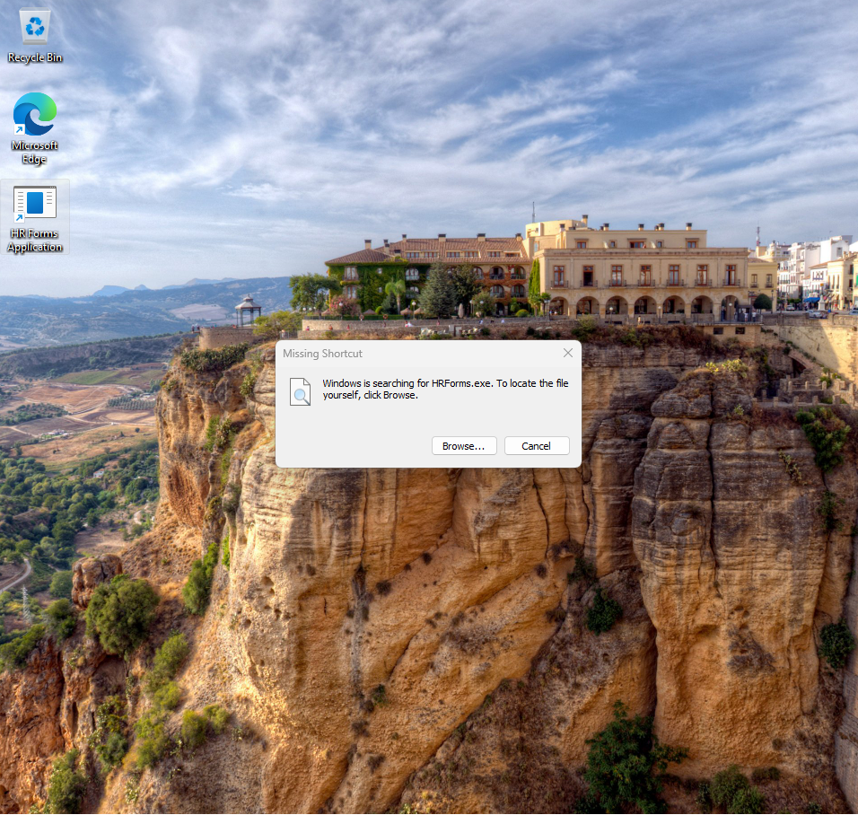
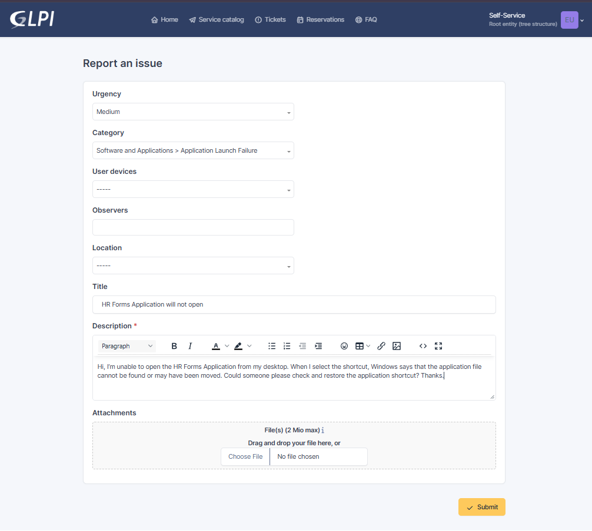
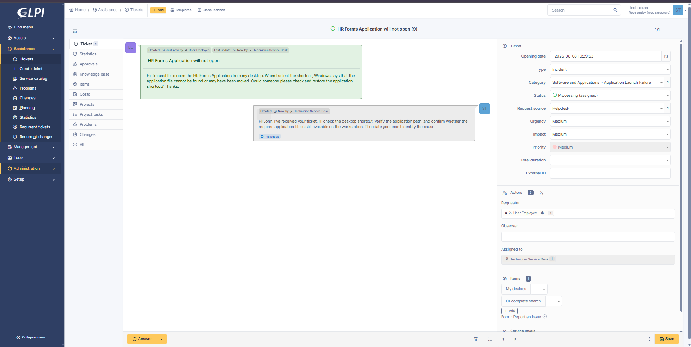
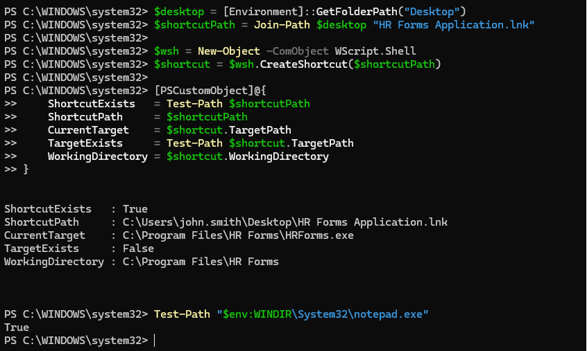
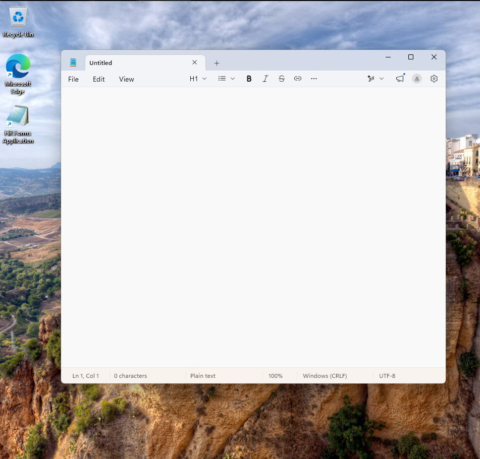
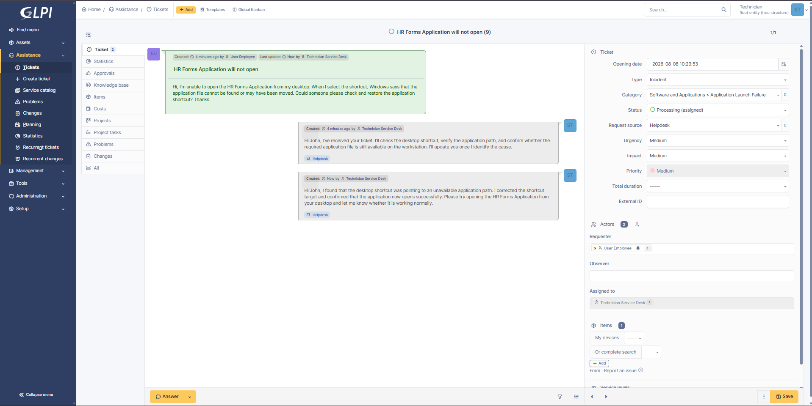
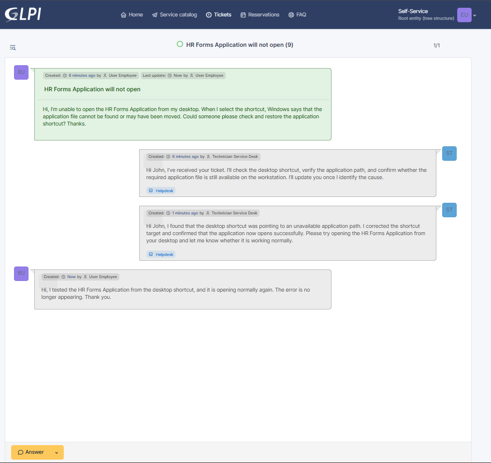
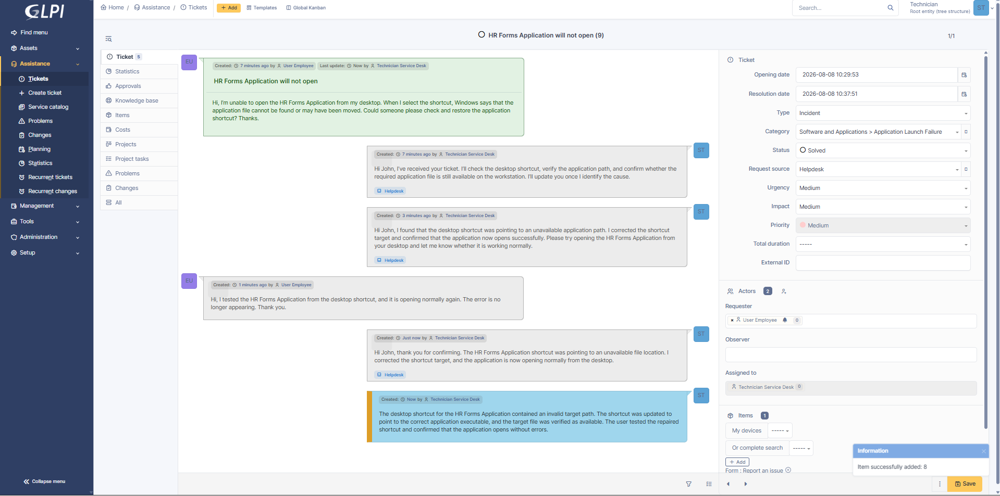
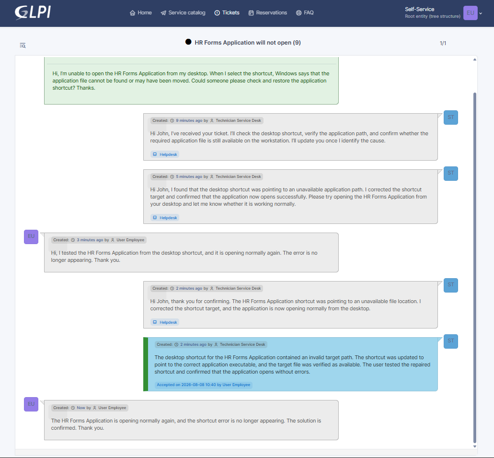

# INC-008 — Business Application Will Not Open

## Ticket Details

| Field | Value |
|---|---|
| Portfolio ID | INC-008 |
| GLPI Ticket ID | #8 |
| Ticket type | Incident |
| Category | Software and Applications > Application Launch Failure |
| Status | Closed |
| Urgency | Medium |
| Impact | Medium |
| Priority | Medium |
| Support level | Level 1 |
| Requester | John Smith |
| Assigned technician | Service Desk Technician |
| Affected account | `john.smith` |
| Affected workstation | CLIENT01 |
| Ticketing server | GLPI01 |
| Affected application | HR Forms Application |
| Issue | Invalid desktop-shortcut target |

---

## Issue Type

This was an application-launch incident.

John Smith reported that the HR Forms Application would not open from its desktop shortcut. Windows displayed an error indicating that the application file could not be found or may have been moved.

The issue affected one workstation and prevented the employee from launching the required application from the desktop.

---

## Initial Working State

Before the incident, the HR Forms Application shortcut opened successfully from the user’s desktop.

The shortcut was configured to launch a safe executable used as the application stand-in within the lab environment:

```text
C:\Windows\System32\notepad.exe
```

The desktop shortcut and opened application were confirmed before the incident was reproduced.



---

## User-Reported Issue

John Smith attempted to open:

```text
HR Forms Application
```

Windows displayed an error indicating that the shortcut target could not be found.

The shortcut itself remained visible, but the file location configured inside the shortcut was unavailable.



---

## User Report

John Smith submitted the following incident through GLPI:

> Hi, I’m unable to open the HR Forms Application from my desktop. When I select the shortcut, Windows says that the application file cannot be found or may have been moved. Could someone please check and restore the application shortcut? Thanks.



---

## Systems Involved

| System | Purpose |
|---|---|
| `CLIENT01` | Windows workstation experiencing the application issue |
| `GLPI01` | GLPI ticketing server used to manage the incident |
| HR Forms Application shortcut | Desktop shortcut used to launch the application |
| Application executable | File referenced by the shortcut target |

---

## Technician Acknowledgement

The ticket was assigned to the Service Desk Technician and moved to `Processing`.

> Hi John, I’ve received your ticket. I’ll check the desktop shortcut, verify the application path, and confirm whether the required application file is still available on the workstation. I’ll update you once I identify the cause.



---

## Investigation

The technician located the desktop shortcut and reviewed its configured properties using PowerShell:

```powershell
$desktop = [Environment]::GetFolderPath("Desktop")
$shortcutPath = Join-Path $desktop "HR Forms Application.lnk"

$wsh = New-Object -ComObject WScript.Shell
$shortcut = $wsh.CreateShortcut($shortcutPath)

[PSCustomObject]@{
    ShortcutExists   = Test-Path $shortcutPath
    ShortcutPath     = $shortcutPath
    CurrentTarget    = $shortcut.TargetPath
    TargetExists     = Test-Path $shortcut.TargetPath
    WorkingDirectory = $shortcut.WorkingDirectory
}
```

The result confirmed:

```text
ShortcutExists : True
CurrentTarget  : C:\Program Files\HR Forms\HRForms.exe
TargetExists   : False
```

The desktop shortcut was present, but the configured target executable did not exist.

The known working application executable was then checked:

```powershell
Test-Path "$env:WINDIR\System32\notepad.exe"
```

The result returned:

```text
True
```

This confirmed that a valid executable was available and that the problem was limited to the shortcut configuration.



---

## Investigation Results

| Check | Result |
|---|---|
| Desktop shortcut present | Yes |
| Shortcut launches successfully | No |
| Configured target path reviewed | Yes |
| Configured target file exists | No |
| Valid application executable available | Yes |
| User-account issue identified | No |
| Workstation connectivity issue identified | No |
| Root cause identified | Yes |

---

## Root Cause

The HR Forms Application desktop shortcut contained an invalid target path:

```text
C:\Program Files\HR Forms\HRForms.exe
```

The referenced executable did not exist at that location.

Because the shortcut could not locate its configured target, Windows displayed a missing-item error and prevented the application from launching.

```text
Desktop shortcut selected
            ↓
Windows reads configured target path
            ↓
Target executable cannot be found
            ↓
Shortcut error displayed
            ↓
Application does not open
```

---

## Remediation

The shortcut was updated to point to the validated application executable:

```powershell
$desktop = [Environment]::GetFolderPath("Desktop")
$shortcutPath = Join-Path $desktop "HR Forms Application.lnk"

$wsh = New-Object -ComObject WScript.Shell
$shortcut = $wsh.CreateShortcut($shortcutPath)

$shortcut.TargetPath = "$env:WINDIR\System32\notepad.exe"
$shortcut.WorkingDirectory = "$env:WINDIR\System32"
$shortcut.IconLocation = "$env:WINDIR\System32\notepad.exe,0"
$shortcut.Description = "HR Forms Application"
$shortcut.Save()
```

The repaired shortcut was then reviewed:

```powershell
$shortcut = $wsh.CreateShortcut($shortcutPath)

[PSCustomObject]@{
    ShortcutPath = $shortcutPath
    TargetPath   = $shortcut.TargetPath
    TargetExists = Test-Path $shortcut.TargetPath
}
```

The result showed:

```text
TargetPath   : C:\Windows\System32\notepad.exe
TargetExists : True
```

The shortcut was opened successfully, and the missing-target error no longer appeared.



---

## Technician Request for Testing

After repairing and testing the shortcut, the technician asked John Smith to confirm the application from the employee session.

> Hi John, I found that the desktop shortcut was pointing to an unavailable application path. I corrected the shortcut target and confirmed that the application now opens successfully. Please try opening the HR Forms Application from your desktop and let me know whether it is working normally.



---

## User Validation

John Smith opened the HR Forms Application from the repaired desktop shortcut.

The application launched normally, and Windows no longer displayed the missing-target error.

The employee confirmed through GLPI:

> Hi, I tested the HR Forms Application from the desktop shortcut, and it is opening normally again. The error is no longer appearing. Thank you.



---

## Technician Update

The technician acknowledged the successful test:

> Hi John, thank you for confirming. The HR Forms Application shortcut was pointing to an unavailable file location. I corrected the shortcut target, and the application is now opening normally from the desktop.

---

## Official Solution

> The desktop shortcut for the HR Forms Application contained an invalid target path. The shortcut was updated to point to the correct application executable, and the target file was verified as available. The user tested the repaired shortcut and confirmed that the application opens without errors.

The ticket status was changed to `Solved`.



---

## Ticket Closure

John Smith reviewed and accepted the solution.

The employee confirmed:

> The HR Forms Application is opening normally again, and the shortcut error is no longer appearing. The solution is confirmed. Thank you.

The ticket status was changed to `Closed`.



---

## Validation Results

| Validation check | Result |
|---|---|
| Application-launch failure confirmed | Passed |
| Desktop shortcut located | Passed |
| Shortcut properties reviewed | Passed |
| Invalid target path identified | Passed |
| Target-file availability tested | Passed |
| Correct executable identified | Passed |
| Shortcut target repaired | Passed |
| Corrected target verified | Passed |
| Application launched successfully | Passed |
| Missing-target error removed | Passed |
| Employee confirmed normal operation | Passed |
| Ticket closed | Passed |

---

## Ticket Timeline

| Step | Action | Result |
|---:|---|---|
| 1 | John Smith attempted to open the application | Shortcut error displayed |
| 2 | John Smith submitted Ticket #8 | Incident recorded |
| 3 | Technician accepted and acknowledged the ticket | Ticket moved to Processing |
| 4 | Desktop shortcut was located | Shortcut confirmed present |
| 5 | Shortcut target was reviewed | Invalid file path identified |
| 6 | Configured target was tested | Target file not found |
| 7 | Valid application executable was checked | Executable available |
| 8 | Shortcut configuration was corrected | Valid target assigned |
| 9 | Corrected shortcut was verified | Target file confirmed available |
| 10 | Application was opened by the technician | Launch successful |
| 11 | Technician requested user testing | Validation requested |
| 12 | John opened the application | Error no longer appeared |
| 13 | Employee confirmed the fix | Application working normally |
| 14 | Technician recorded the official solution | Ticket moved to Solved |
| 15 | Employee accepted the solution | Ticket closed |

---

## Closure

| Closure check | Result |
|---|---|
| Incident investigated | Yes |
| Shortcut location confirmed | Yes |
| Invalid target identified | Yes |
| Correct target configured | Yes |
| Application launch verified | Yes |
| Employee confirmation received | Yes |
| Technician update recorded | Yes |
| Official solution recorded | Yes |
| Ticket closed | Yes |

---

## How the Issue Was Resolved

John Smith reported that the HR Forms Application would not open and that Windows displayed an error indicating that the shortcut target could not be found.

I located the desktop shortcut and reviewed its configured target path. The shortcut was present, but it pointed to an executable that did not exist on the workstation.

I confirmed that the validated application executable was available, then updated the shortcut target, working directory, icon, and description.

After saving the corrected shortcut, I verified that the target file existed and opened the application successfully. John then tested the shortcut from his desktop and confirmed that the application opened normally without the previous error.

---

## Technician Insight

I first separated the shortcut problem from a full application or workstation failure. The shortcut was still present, so I inspected the target path before attempting a reinstall.

Testing the configured target with `Test-Path` confirmed that the referenced executable was unavailable. This provided a clear root cause and avoided unnecessary changes to the operating system or user account.

After repairing the shortcut, I verified both the target-file path and the actual application launch. I then asked the employee to repeat the same action that originally failed before closing the incident.

---

## Evidence Files

```text
images/INC-008-01-application-working-baseline.png
images/INC-008-02-application-shortcut-error.png
images/INC-008-03-ticket-submitted.png
images/INC-008-04-ticket-assigned-and-acknowledged.png
images/INC-008-05-shortcut-target-investigation.png
images/INC-008-06-application-shortcut-repaired.png
images/INC-008-07-technician-requested-application-testing.png
images/INC-008-08-user-confirmed-application-working.png
images/INC-008-09-ticket-solved.png
images/INC-008-10-ticket-closed.png
```

---

## Final Status

```text
Portfolio ID           : INC-008
GLPI Ticket ID         : #8
Ticket type            : Incident
Issue                  : Business Application Will Not Open
Affected user          : John Smith
Affected workstation   : CLIENT01
Affected application   : HR Forms Application
Root cause             : Invalid desktop-shortcut target
Shortcut repaired      : Yes
Application launch     : Successful
User confirmed         : Yes
Final status           : CLOSED
```
