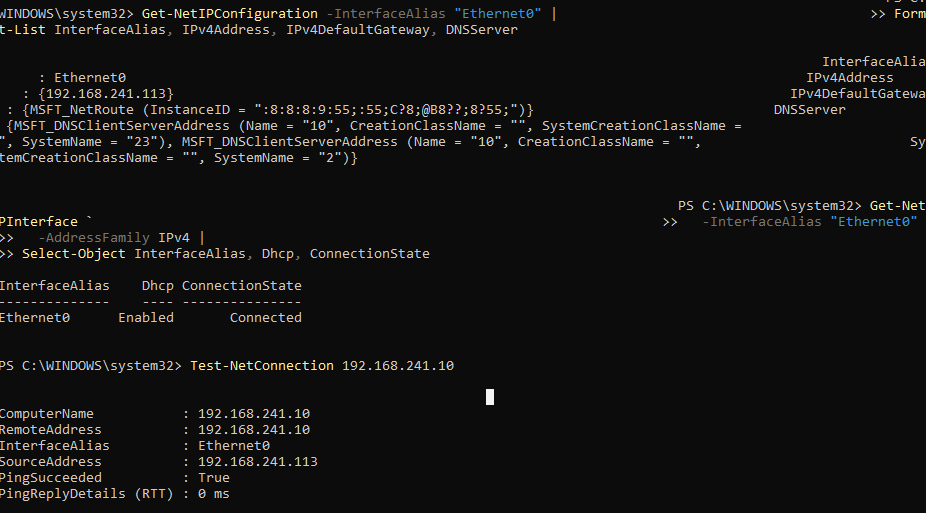
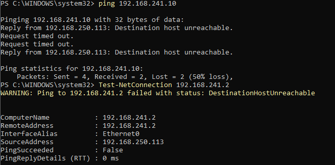
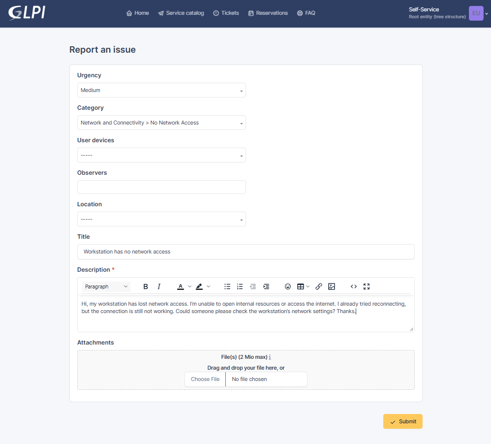
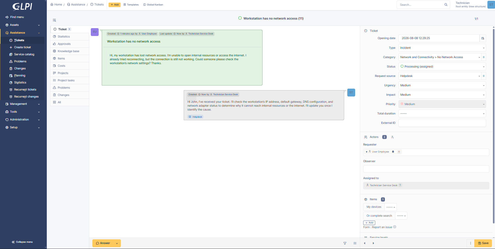
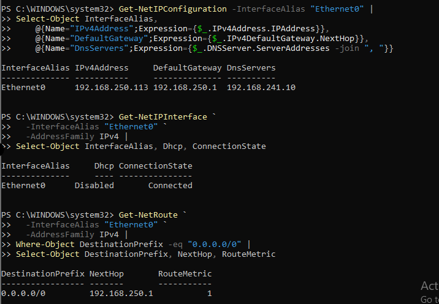
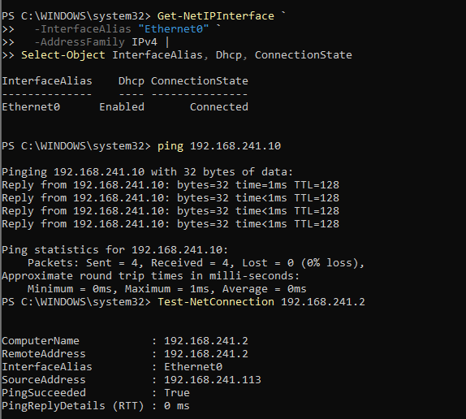
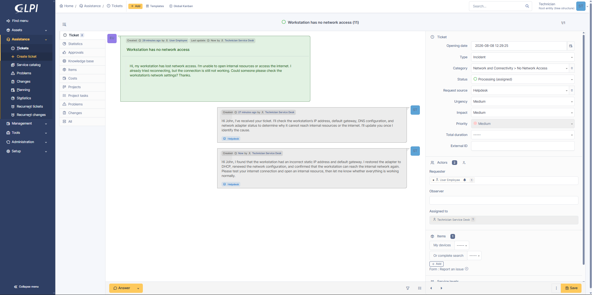
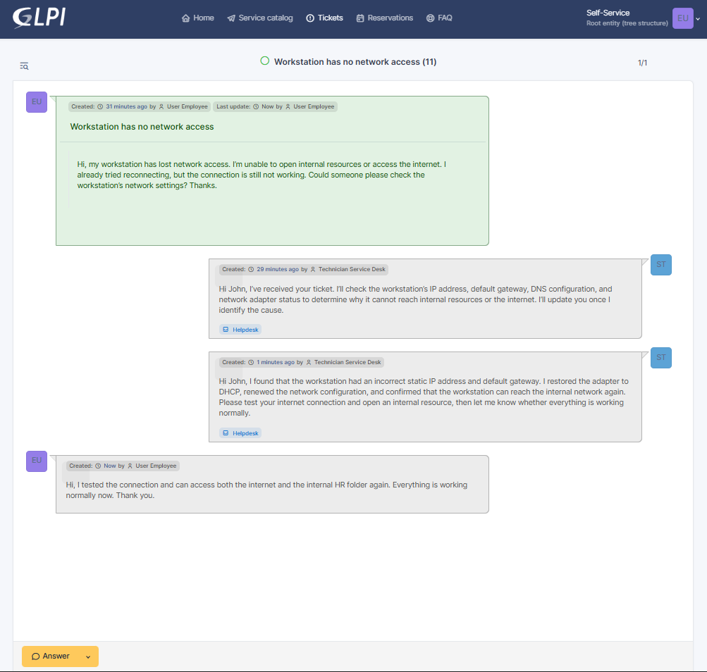
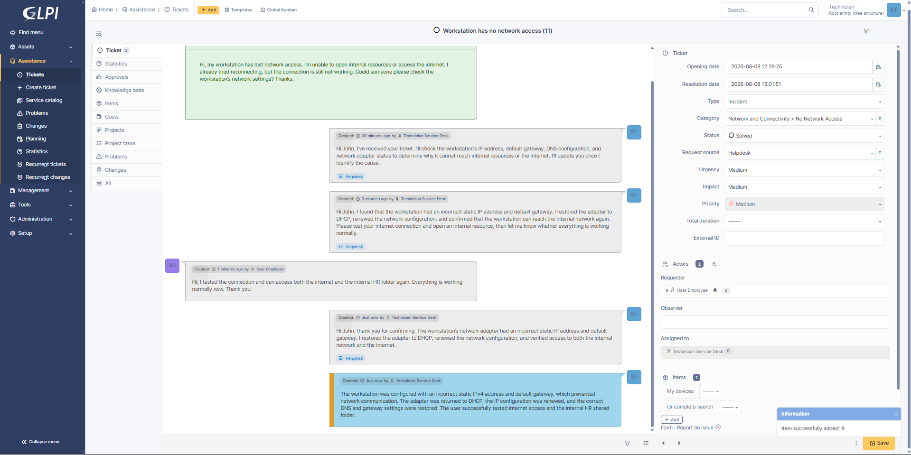
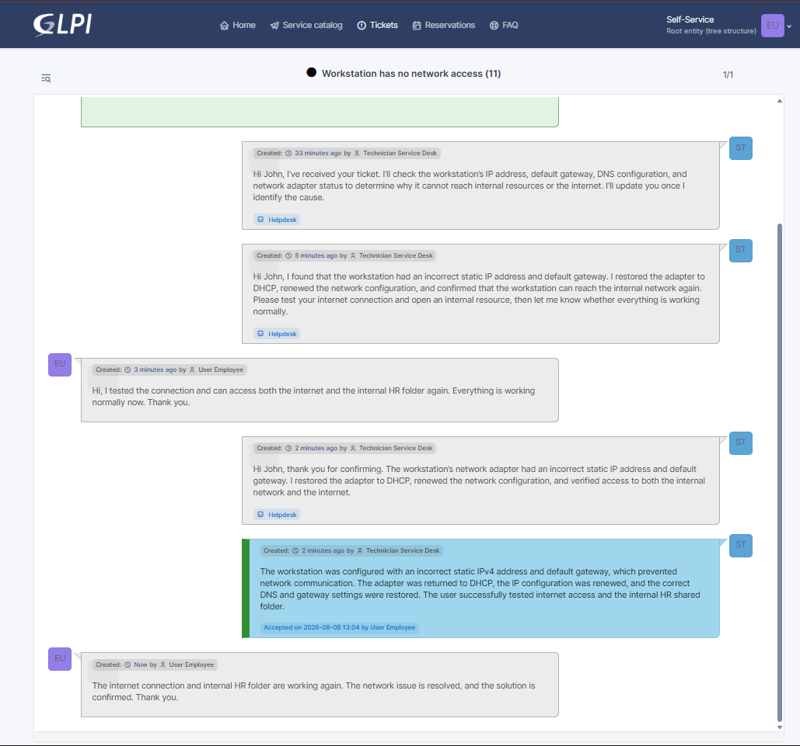

# INC-009 — Workstation Has No Network Access

## Ticket Details

| Field | Value |
|---|---|
| Portfolio ID | INC-009 |
| GLPI Ticket ID | #9 |
| Ticket type | Incident |
| Category | Network and Connectivity > No Network Access |
| Status | Closed |
| Urgency | Medium |
| Impact | Medium |
| Priority | Medium |
| Support level | Level 1 |
| Requester | John Smith |
| Assigned technician | Service Desk Technician |
| Affected account | `john.smith` |
| Affected workstation | CLIENT01 |
| Domain server | SRV01 |
| Ticketing server | GLPI01 |
| Network adapter | `Ethernet0` |
| Expected network | `192.168.241.0/24` |
| Expected gateway | `192.168.241.2` |
| Internal DNS server | `192.168.241.10` |

---

## Issue Type

This was a workstation network-connectivity incident.

John Smith reported that `CLIENT01` could not access the internet or internal company resources.

The workstation’s Ethernet adapter was active, but it had an incorrect static IPv4 address and default gateway that did not match the local network.

---

## Initial Working State

Before the incident, `CLIENT01` was configured through DHCP.

The working network configuration was:

```text
IPv4 address    : 192.168.241.113
Default gateway : 192.168.241.2
DNS server      : 192.168.241.10
DHCP            : Enabled
Adapter         : Ethernet0
```

The current configuration was recorded using:

```powershell
Get-NetIPConfiguration -InterfaceAlias "Ethernet0" |
Select-Object InterfaceAlias,
    @{Name="IPv4Address";Expression={$_.IPv4Address.IPAddress}},
    @{Name="DefaultGateway";Expression={$_.IPv4DefaultGateway.NextHop}},
    @{Name="DnsServers";Expression={$_.DNSServer.ServerAddresses -join ", "}}
```

DHCP status was verified using:

```powershell
Get-NetIPInterface `
  -InterfaceAlias "Ethernet0" `
  -AddressFamily IPv4 |
Select-Object InterfaceAlias, Dhcp
```



---

## User-Reported Issue

At the time of the incident, `CLIENT01` had the following IPv4 configuration:

```text
IPv4 address    : 192.168.250.113
Default gateway : 192.168.250.1
DNS server      : 192.168.241.10
DHCP            : Disabled
```

The configured address was outside the correct VMware network:

```text
Expected network : 192.168.241.0/24
Current network  : 192.168.250.0/24
```

Connectivity tests to the internal server and gateway failed.

```powershell
ping 192.168.241.10
```

```powershell
Test-NetConnection 192.168.241.2
```



---

## User Report

John Smith submitted the following incident through GLPI:

> Hi, my workstation has lost network access. I’m unable to open internal resources or access the internet. I already tried reconnecting, but the connection is still not working. Could someone please check the workstation’s network settings? Thanks.



---

## Systems Involved

| System | Purpose |
|---|---|
| `CLIENT01` | Workstation experiencing the network outage |
| `SRV01` | Active Directory, DNS, and internal resource server |
| `GLPI01` | GLPI ticketing server |
| `Ethernet0` | Network adapter used by CLIENT01 |
| VMware NAT network | Provides local network and internet connectivity |

---

## Technician Acknowledgement

The ticket was assigned to the Service Desk Technician and moved to `Processing`.

> Hi John, I’ve received your ticket. I’ll check the workstation’s IP address, default gateway, DNS configuration, and network adapter status to determine why it cannot reach internal resources or the internet. I’ll update you once I identify the cause.



---

## Investigation

The technician reviewed the workstation’s current IPv4 configuration:

```powershell
Get-NetIPConfiguration -InterfaceAlias "Ethernet0" |
Select-Object InterfaceAlias,
    @{Name="IPv4Address";Expression={$_.IPv4Address.IPAddress}},
    @{Name="DefaultGateway";Expression={$_.IPv4DefaultGateway.NextHop}},
    @{Name="DnsServers";Expression={$_.DNSServer.ServerAddresses -join ", "}}
```

The result showed:

```text
IPv4 address    : 192.168.250.113
Default gateway : 192.168.250.1
DNS server      : 192.168.241.10
```

The DHCP state was checked:

```powershell
Get-NetIPInterface `
  -InterfaceAlias "Ethernet0" `
  -AddressFamily IPv4 |
Select-Object InterfaceAlias, Dhcp, ConnectionState
```

The adapter showed:

```text
DHCP            : Disabled
Connection state: Connected
```

The default route was reviewed:

```powershell
Get-NetRoute `
  -InterfaceAlias "Ethernet0" `
  -AddressFamily IPv4 |
Where-Object DestinationPrefix -eq "0.0.0.0/0" |
Select-Object DestinationPrefix, NextHop, RouteMetric
```

The configured route used the incorrect gateway:

```text
Next hop : 192.168.250.1
```



---

## Investigation Results

| Check | Result |
|---|---|
| Ethernet adapter connected | Yes |
| DHCP enabled | No |
| Static IPv4 address configured | Yes |
| IPv4 address in correct subnet | No |
| Default gateway correct | No |
| Internal DNS server configured | Yes |
| Internal server reachable | No |
| Gateway reachable | No |
| Root cause identified | Yes |

---

## Root Cause

`CLIENT01` was configured with an incorrect static IPv4 address and default gateway.

The workstation was using the `192.168.250.0/24` subnet, while the actual VMware network used `192.168.241.0/24`.

Because the workstation and default gateway were configured for the wrong network, packets could not reach the real gateway, internal server, or internet.

```text
Incorrect static IPv4 address configured
                    ↓
Workstation placed on the wrong subnet
                    ↓
Configured gateway unavailable
                    ↓
Internal and internet traffic cannot be routed
                    ↓
Complete network-access failure
```

---

## Remediation

The network adapter was returned to DHCP:

```powershell
Set-NetIPInterface `
  -InterfaceAlias "Ethernet0" `
  -AddressFamily IPv4 `
  -Dhcp Enabled
```

The DNS server configuration was reset so that the workstation could receive the correct settings:

```powershell
Set-DnsClientServerAddress `
  -InterfaceAlias "Ethernet0" `
  -ResetServerAddresses
```

The DHCP lease was released and renewed:

```powershell
ipconfig /release
ipconfig /renew
```

The local DNS cache was cleared:

```powershell
ipconfig /flushdns
```

The restored configuration was verified:

```powershell
Get-NetIPConfiguration -InterfaceAlias "Ethernet0" |
Select-Object InterfaceAlias,
    @{Name="IPv4Address";Expression={$_.IPv4Address.IPAddress}},
    @{Name="DefaultGateway";Expression={$_.IPv4DefaultGateway.NextHop}},
    @{Name="DnsServers";Expression={$_.DNSServer.ServerAddresses -join ", "}}
```

DHCP status was confirmed:

```powershell
Get-NetIPInterface `
  -InterfaceAlias "Ethernet0" `
  -AddressFamily IPv4 |
Select-Object InterfaceAlias, Dhcp, ConnectionState
```

The workstation received valid settings from the correct network:

```text
IPv4 address    : 192.168.241.x
Default gateway : 192.168.241.2
DNS server      : 192.168.241.10
DHCP            : Enabled
```

Connectivity was tested again:

```powershell
ping 192.168.241.10
```

```powershell
Test-NetConnection 192.168.241.2
```

Both tests completed successfully.



---

## Technician Request for Testing

After restoring the network configuration, the technician asked John Smith to test both internal and external connectivity.

> Hi John, I found that the workstation had an incorrect static IP address and default gateway. I restored the adapter to DHCP, renewed the network configuration, and confirmed that the workstation can reach the internal network again. Please test your internet connection and open an internal resource, then let me know whether everything is working normally.



---

## User Validation

John Smith tested:

- Internet access through a web browser
- Internal access to the HR shared folder
- General workstation network connectivity

The employee confirmed through GLPI:

> Hi, I tested the connection and can access both the internet and the internal HR folder again. Everything is working normally now. Thank you.



---

## Technician Update

The technician acknowledged the successful validation:

> Hi John, thank you for confirming. The workstation’s network adapter had an incorrect static IP address and default gateway. I restored the adapter to DHCP, renewed the network configuration, and verified access to both the internal network and the internet.

---

## Official Solution

> The workstation was configured with an incorrect static IPv4 address and default gateway, which prevented network communication. The adapter was returned to DHCP, the IP configuration was renewed, and the correct DNS and gateway settings were restored. The user successfully tested internet access and the internal HR shared folder.

The ticket status was changed to `Solved`.



---

## Ticket Closure

John Smith reviewed and accepted the solution.

The employee confirmed:

> The internet connection and internal HR folder are working again. The network issue is resolved, and the solution is confirmed. Thank you.

The ticket status was changed to `Closed`.



---

## Validation Results

| Validation check | Result |
|---|---|
| Network outage confirmed | Passed |
| Ethernet adapter state checked | Passed |
| Current IPv4 address reviewed | Passed |
| Default gateway reviewed | Passed |
| DNS configuration reviewed | Passed |
| DHCP state checked | Passed |
| Incorrect subnet identified | Passed |
| Incorrect default gateway identified | Passed |
| Adapter returned to DHCP | Passed |
| DHCP lease renewed | Passed |
| Correct gateway restored | Passed |
| Correct DNS server restored | Passed |
| Internal server reachable | Passed |
| Internet connectivity restored | Passed |
| HR shared folder accessible | Passed |
| Employee confirmed restored access | Passed |
| Ticket closed | Passed |

---

## Ticket Timeline

| Step | Action | Result |
|---:|---|---|
| 1 | John Smith experienced complete network loss | Internal and internet access unavailable |
| 2 | Current IP configuration was observed | Incorrect subnet identified |
| 3 | John Smith submitted Ticket #9 | Incident recorded |
| 4 | Technician accepted and acknowledged the ticket | Ticket moved to Processing |
| 5 | Network adapter configuration was reviewed | Incorrect static IPv4 address found |
| 6 | DHCP state was checked | DHCP disabled |
| 7 | Default route was reviewed | Incorrect gateway identified |
| 8 | Root cause was confirmed | Workstation configured for wrong subnet |
| 9 | Adapter was returned to DHCP | Automatic addressing restored |
| 10 | DHCP lease was renewed | Valid configuration received |
| 11 | DNS cache was cleared | Cached records refreshed |
| 12 | Gateway and internal server were tested | Connectivity restored |
| 13 | Technician requested user testing | Validation requested |
| 14 | John tested internet and internal access | Both services available |
| 15 | Technician recorded the official solution | Ticket moved to Solved |
| 16 | Employee accepted the solution | Ticket closed |

---

## Closure

| Closure check | Result |
|---|---|
| Incident investigated | Yes |
| Network adapter reviewed | Yes |
| IPv4 configuration reviewed | Yes |
| Root cause identified | Yes |
| DHCP restored | Yes |
| Correct network settings received | Yes |
| Internal connectivity restored | Yes |
| Internet access restored | Yes |
| Employee confirmation received | Yes |
| Technician update recorded | Yes |
| Official solution recorded | Yes |
| Ticket closed | Yes |

---

## How the Issue Was Resolved

John Smith reported that his workstation could not access either the internet or internal company resources.

I checked the network adapter and found that it was connected, but DHCP was disabled. The workstation had a static IPv4 address of `192.168.250.113` and a default gateway of `192.168.250.1`, which did not match the correct `192.168.241.0/24` network.

I restored the Ethernet adapter to DHCP, reset the DNS configuration, renewed the DHCP lease, and cleared the local DNS cache.

The workstation then received a valid `192.168.241.x` address, the correct `192.168.241.2` default gateway, and the internal `192.168.241.10` DNS server.

I confirmed connectivity to the gateway and internal server. John then tested the internet and HR shared folder and confirmed that both were working normally.

---

## Technician Insight

I first checked whether the network adapter was disconnected or disabled. The adapter was connected, so I focused on the IPv4 configuration.

The address and gateway belonged to a different subnet from the actual VMware network. This explained why both internal and internet communication failed, even though Windows showed the adapter as connected.

Restoring DHCP was safer than manually entering the previously recorded address because DHCP could provide the correct address, gateway, and DNS configuration automatically.

I validated both internal and external access after the repair because successfully reaching only one destination would not prove that the entire network configuration was working.

---

## Evidence Files

```text
images/INC-009-01-working-network-baseline.png
images/INC-009-02-network-connectivity-failed.png
images/INC-009-03-ticket-submitted.png
images/INC-009-04-ticket-assigned-and-acknowledged.png
images/INC-009-05-ip-configuration-investigation.png
images/INC-009-06-network-configuration-restored.png
images/INC-009-07-technician-requested-connectivity-testing.png
images/INC-009-08-user-confirmed-network-restored.png
images/INC-009-09-ticket-solved.png
images/INC-009-10-ticket-closed.png
```

---

## Final Status

```text
Portfolio ID          : INC-009
GLPI Ticket ID        : #9
Ticket type           : Incident
Issue                 : Workstation Has No Network Access
Affected user         : John Smith
Affected workstation  : CLIENT01
Network adapter       : Ethernet0
Root cause            : Incorrect static IPv4 address and default gateway
DHCP restored         : Yes
Correct subnet        : Restored
Internal access       : Restored
Internet access       : Restored
User confirmed        : Yes
Final status          : CLOSED
```
