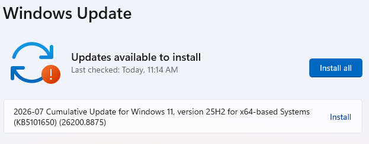
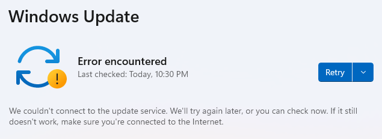
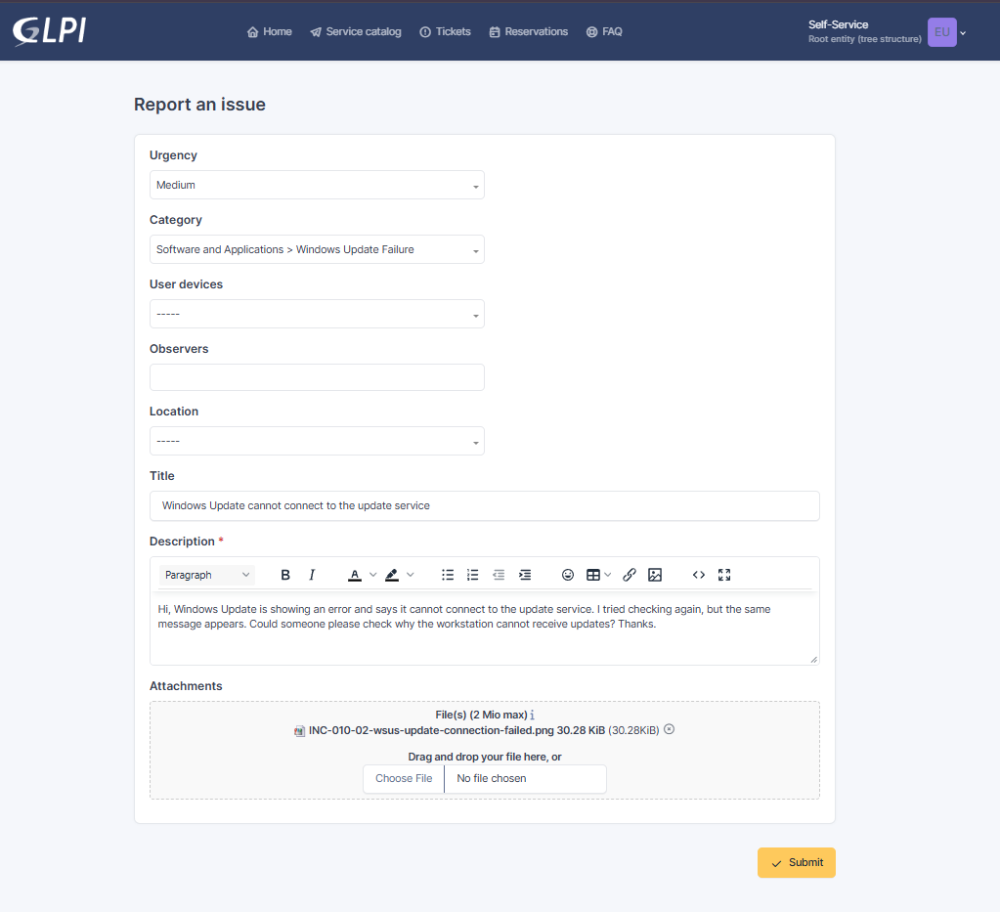
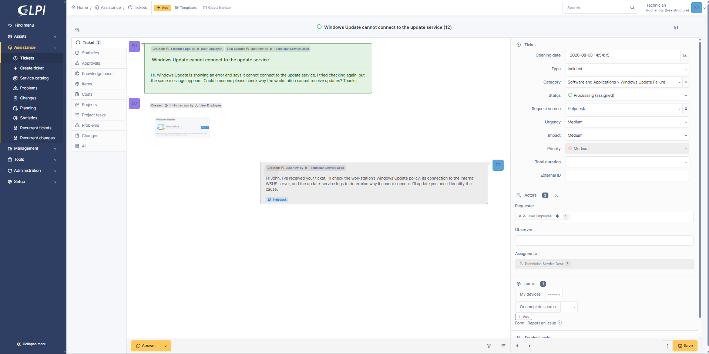

# INC-010 — Windows Update Connection Failure

## Ticket Details

| Field | Value |
|---|---|
| Portfolio ID | INC-010 |
| GLPI Ticket ID | #10 |
| Ticket type | Incident |
| Category | Software and Applications > Windows Update Failure |
| Status | Closed |
| Urgency | Medium |
| Impact | Medium |
| Priority | Medium |
| Support level | Level 1 |
| Requester | John Smith |
| Assigned technician | Service Desk Technician |
| Affected account | `john.smith` |
| Affected workstation | CLIENT01 |
| Update server | SRV01 |
| Ticketing server | GLPI01 |
| Update platform | Windows Server Update Services |
| Correct WSUS endpoint | `http://SRV01:8530` |
| Affected service | Windows Update |

---

## Issue Type

This was a Windows Update connectivity incident involving a domain-managed workstation.

John Smith reported that Windows Update could not connect to the organization’s update service.

The workstation was configured to receive updates from the internal WSUS server, but its update policy contained an incorrect server port.

---

## Initial Working State

Before the incident, Windows Update successfully contacted the configured update service and detected an available cumulative update.

The following update-related services were running:

```text
Background Intelligent Transfer Service : Running
Cryptographic Services                   : Running
Windows Update                           : Running
```

The service configuration was recorded using:

```powershell
Get-Service wuauserv, bits, cryptsvc |
Select-Object DisplayName, Name, Status, StartType
```

Windows Update successfully completed a check for available updates.



---

## User-Reported Issue

When John Smith attempted to check for updates, Windows displayed:

```text
We couldn't connect to the update service.
We'll try again later, or you can check now.
If it still doesn't work, make sure you're connected to the Internet.
```

The workstation remained connected to the network, but it could not communicate with the configured internal update endpoint.



---

## User Report

John Smith submitted the following incident through GLPI:

> Hi, Windows Update is showing an error and says it cannot connect to the update service. I tried checking again, but the same message appears. Could someone please check why the workstation cannot receive updates? Thanks.



---

## Systems Involved

| System | Purpose |
|---|---|
| `CLIENT01` | Domain-managed workstation experiencing the update failure |
| `SRV01` | Internal server hosting Windows Server Update Services |
| `GLPI01` | GLPI ticketing server used to manage the incident |
| Windows Update service | Detects and installs Windows updates |
| BITS | Downloads update content in the background |
| Group Policy | Provides the workstation’s WSUS configuration |
| WSUS | Centralized update-management service |

---

## Technician Acknowledgement

The ticket was assigned to the Service Desk Technician and moved to `Processing`.

> Hi John, I’ve received your ticket. I’ll check the workstation’s Windows Update policy, its connection to the internal WSUS server, and the update-service logs to determine why it cannot connect. I’ll update you once I identify the cause.



---

## Investigation

The technician first reviewed the workstation’s configured update-server addresses:

```powershell
$wsusPath = "HKLM:\SOFTWARE\Policies\Microsoft\Windows\WindowsUpdate"
